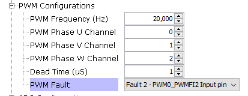
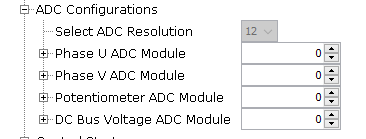
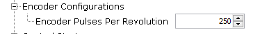

## Configuring the Library

Different UI configurations are explained below. 

### Control Algorithm Parameters
Allows to select application mode like open loop or speed loop or torque loop. 

Position feedback determines the feedback loop implementation like PLL estimator sensorless or Encoder based sensored algorithm. 

This allows to configure startup parameters and control loop PI parameters. 

### Flying Start Parameters
Allows configuration of Flying Start Detection Parameters. 

By default, the implementation of this mode is part of an archive file lib_mc_flyingstart.a. In order to access the source file, please contact [Microchip's Local Sales Office](https://www.microchip.com/salesdirectory).

- Flying Start Detect mode uses a separate set of current controller PI gains which can be different than current control PI gains used in normal Run mode. It is recommended that in Flying Start Mode, the current controllers should have higher bandwidth than during normal Run mode.

- Flying Start Detect Duration - Defines the duration in seconds for which the control algorithm will attempt to ascertain if the motor is freewheeling. 

- Minimum Flying Start Speed - Defines the minimum speed in RPM below which if the motor is freewheeling, the control algorithm would deem it as "Not Freewheeling"

- Flying Start Current - Defines the starting current in A which would be used during transition from Flying Start Detection -> Closed Loop operation.

- Null Vector Braking Duration - Defines the passive braking duration in seconds, implemented by applying null vector pulses to the motor windings. 

- Regenerative Braking - When enabled, if the motor's freewheeling speed is above the minimum flying start detect speed and in the opposite direction to that of command direction, the control algorithm would actively brake the motor using regenerative braking until the motor speed falls below minimum flying start detect speed. 

    - Peak Regenerative Braking Current - Defines the maximum regenerative braking current applied in A.
    - Regenerative Braking Ramp Duration - Defines the duration in seconds during which the regenerative braking current ramps from 0 to Peak Regenerative Braking Current. 

### PWM Configurations
Select the PWM frequency and PWM channels used to drive Phase U, V and W based on board connections. Selected configurations are passed to the PWM PLIB. PWM PLIB is auto-configured for FOC algorithm. 

*Note: Flying start is not supported in SAMC21 and PIC32MK CM MC project. 

### ADC Configurations

Select ADC channels used for Phase U current, Phase V Current, DC Bus voltage and potentiometer based on the board connections. Selected configurations are passed to the ADC PLIB. ADC PLIB is auto-configured for FOC algorithm. 

### Encoder Configurations

Select the number of encoder pulses per revolution of the motor. Selected configurations are passed to the QDEC PLIB. 

### Motor Parameters

Allows to configure motor parameters. Microchip direct motors are selectable and pre-configured. User can select custom motor to configure parameters for other motors. 

### Control Board Parameters

Allows to configure control board parameters. Microchip's motor control development boards like dsPICDEM MCLV-2 development board are selectable and pre-configured. User can select custom board to configure parameters for other boards. 

### IO Pin Configurations

Configure I/O pins for PWM, ADC, Encoder, UART, input switches and LEDs using the pin manager. 

### Clock Configurations

CPU clock speed is defaulted to maximum recommended clock frequency of the MCU. View or modify the clock speed using clock manager.

