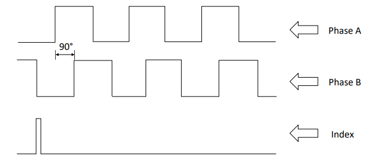
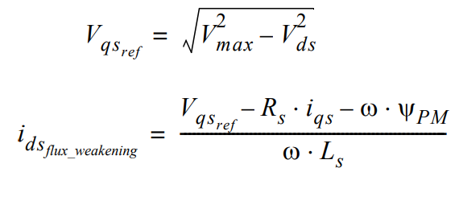

---
parent: Non Motor Control Plant Projects		
grand_parent: PMSM FOC Component
title: Control Algorithm
nav_order: 2
has_children: false
has_toc: false
--- 
## Control Algorithm

**Field Oriented Control (FOC)**:

Field Oriented Control is the technique used to achieve the decoupled control of torque and flux. This is done by transforming the stator current quantities (phase currents) from stationary reference frame to torque and flux producing currents components in rotating reference frame using mathematical transformations. The Field Oriented Control is done as follows: 

-   Measure the motor phase currents. 
-   Transform them into the two phase system (a, b) using the Clarke transformation. 
-   Calculate the rotor position angle. There are different ways to get the rotor position angle like using PLL estimator or quadrature encoder sensor. 
-   Transform stator currents into the d,q-coordinate system using the Park transformation. 
-   The stator current's torque (iq) and flux (id) producing components are controlled separately by the controllers. 
-   The output stator voltage space vector is transformed back from the d,q-coordinate system into the two phase system fixed with the stator by the Inverse Park transformation. 
-   Using the space vector modulation, the three-phase output voltage is generated. 

**PLL Estimator**

The working principle of the PLL estimator can be found in [Application Note AN2520](http://ww1.microchip.com/downloads/en/AppNotes/Sensorless-FOC-For-PMSM-using-PLL-Estimator-FW-AN-DS00002520C.pdf). Its operating principle
is based on the fact that the d-component of the Back Electromotive Force (BEMF) must be equal to zero at a steady state functioning mode.

The main disadvantage of PLL estimator is its inability to estimate the rotor angle at lower rotor speeds because of very low value of back EMF. Therefore, the FOC algorithm also integrates the ramp-up profile for motor start. The reference speed is incremented linearly using an open loop phase voltage control until the required minimum reference speed for the PLL estimator is reached.

**Reduced Order Luenberger Observer**

The working principle of the Reduced Order Luenberger Observer can be found in [Application Note AN2590](https://www.microchip.com/wwwAppNotes/AppNotes.aspx?appnote=en603273).

Like any other back EMF based sensorless technique, the main disadvantage of Reduced Order Luenberger Observer is its inability to estimate the rotor angle at lower rotor speeds because of very low value of back EMF. Therefore, the FOC algorithm also integrates the ramp-up profile for motor start. The reference speed is incremented linearly using an open loop phase voltage control until the required minimum reference speed for the observer is reached.

**Quadrature Encoder**	

An incremental optical encoder provides two pulse trains which are in quadrature with each other. Some encoders also have an index pulse which helps in finding the precide rotor position spatially. 

Microcontroller quadrature encoder peripheral is used to capture and decode quadrature encoder siganls. Peripheral gives the rotor position based on the quadrature pulse. And velocity is calculated by measuring encoder pulses in known time interval. PIC32MK QEI peripheral gives the velocity directly. 
Please refer to the [Application Note AN2757](https://www.microchip.com/wwwAppNotes/AppNotes.aspx?appnote=en607365)

**Field Weakening**

The field weakening for PMSM implies imposing a negative value of d-axis current, which has the role of weakening the air gap flux linkage. Field weakening is required to enable the PMSM motor to rotate above its rated speed. An equation based field weakening is implemented.

**Flying Start**

This feature detects if motor shaft is freewheeling due to stored momentum or external force and estimates the rotor angle, speed and direction of the freewheeling motor. If the freewheeling speed is greater than the minimum speed and is rotating in intended direction, this algorithm catches the motor rotation and directly switches to closed loop control. If speed is less then it applies break to halt the motor and starts the control from stationary position. 

