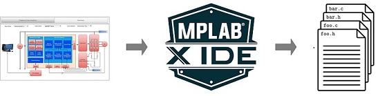

---
title: Motor Control Plant Projects
nav_order: 3
has_children: true
has_toc: false
--- 

# Theoretical Background
This section briefly describes some of the theoretical concepts related to PMSM control.

# Harmony QSpin Motor Control 

## Introduction
The QSpin Motor Control Configuration referred as **Harmony Qspin" is an extension of the MPLAB® ecosystem for developing Microchip’s next-generation application firmware for motor control on Microchip® 32-bit devices. 

It has a graphical tool that enables an effortless configuration and generation of motor control application C code for Microchip 32-bit devices to quickly spin (Qspin) the motor. 
    

        
        <figcaption align= "center"> System Diagram </figcaption>
    

This document introduces the readers to the basics of an PMSM based electric motor drive, and how **Harmony QSpin** can be used to quickly develop their own motor control application firmware. 

## Electrical Motor Drive

- [Permanent Magnet Synchronous Motor](theory/pmsm_motor.md)
- Field Oriented Control (FOC)
    - [Field Oriented Control Theory](theory/field_oriened_control.md)
    - [Current Measurement Principles](theory/current_measurement.md)
    - [Rotor Position Measurement Principles](theory/rotor_position_measurement.md)

- [Software Design and Architecture ](theory/software_architecture.md)
 

## Getting Started
This section briefly describes the basic steps to get started with the **Harmony Qspin**. It consists of following steps:

- [Create a new MPLAB® Harmony v3 project using MCC](mc_plant/create_mc_project_with_mcc.md)
- [Configure motor control firmware using Qspin Motor Control Configuration](mc_plant/qspin_motor_control_configuration.md)
- [Generate the source code](mc_plant/generate_mc_code_with_mcc.md)

