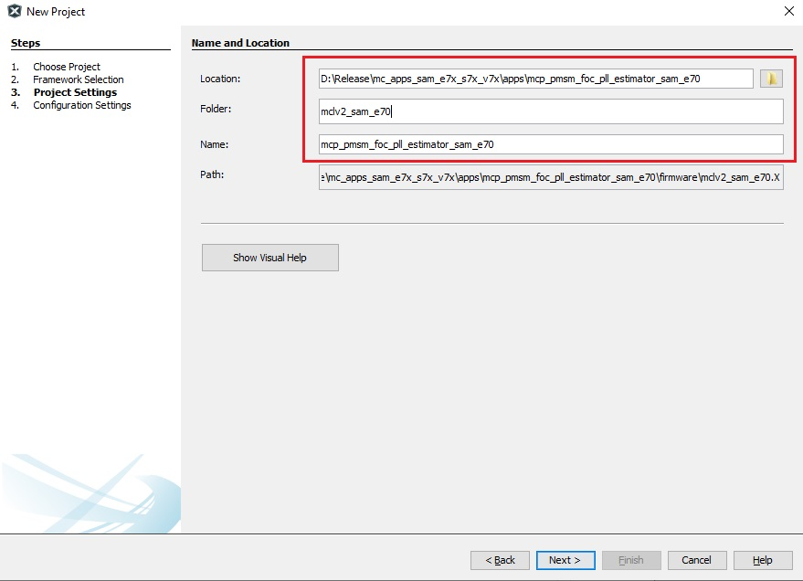
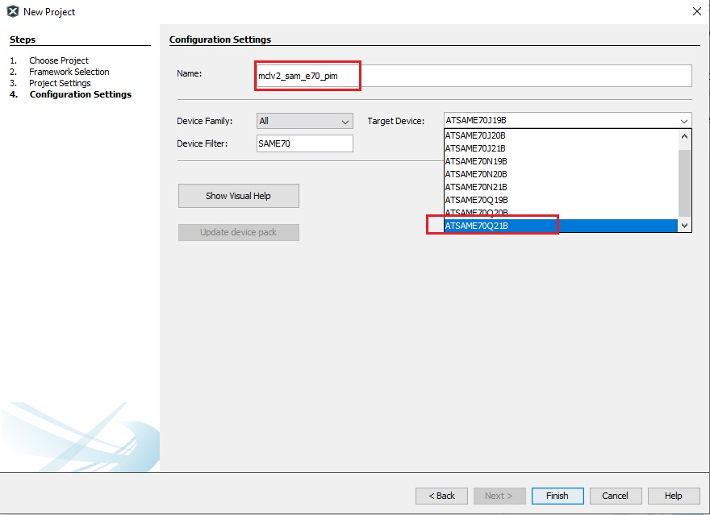
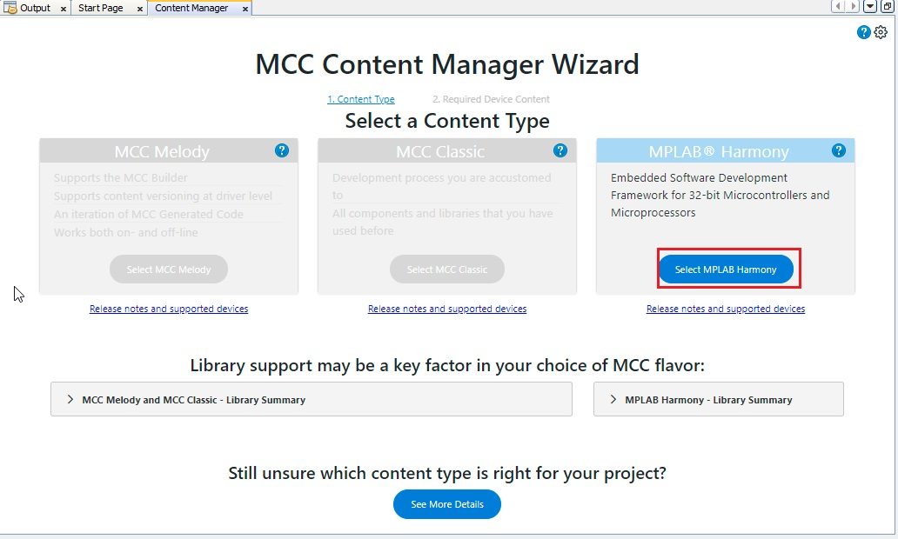
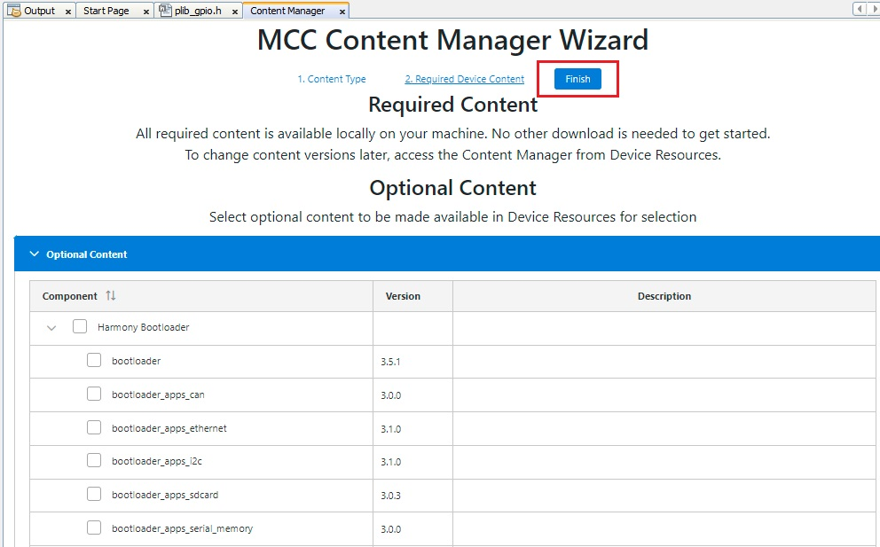
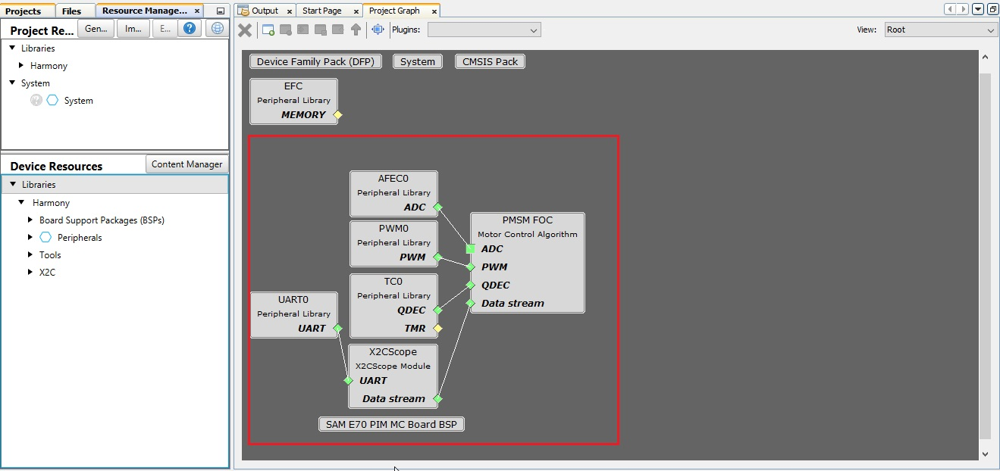

<!-- Styling  -->

# Create a new MPLAB® Harmony v3 project using MCC

This section describes step by step process for creating a new Motor Control Project using MPLAB Code Configurator (MCC) from scratch. 

## Procedure
The following section describes uses SAME70 microcontroller to illustrate the process for creating a new motor control project with Motor Control Plant.

1. Launch MPLAB® X IDE from the Microsoft Windows® Start menu. 
2. Go to the **File** option in the menu bar and select "**New project**"
3. In the Categories pane of the New Project dialog, select Microchip Embedded. In the Projects pane, select 32-bit MCC Harmony Project, then click Next.
4. In the Framework Path edit box, browse to the folder where you downloaded the framework. 
    

        
        <figcaption align= "center">Figure.1 - Framework path </figcaption>
    

5. In the Project Settings window, apply the following settings:
    - **Location**: Indicates the path to the root folder of the new project. All project files will be placed inside this folder. The project location can be any valid path, for example: <Folder of your choice>\dev\same51n_getting_started.
    - **Folder**: Indicates the name of the MPLABX .X folder. Enter "sam_e51_cnano" to create a sam_e51_cnano.X folder.

    - **Name**: Enter the project’s logical name as "getting_started_sam_e51_cnano". This is the name that will be shown from within MPLAB X IDE.

    - Click Next to proceed to Configuration Settings.

    

        
        <figcaption align= "center">Figure.1 - Project set-up </figcaption>
    

6. Follow the steps below to set the project’s Configuration Settings.

    - **Name**: Enter the configuration name as "mclv2_sam_e70_pim".

    - **Target Device**: Select ATSAME70Q21B as the target device.
        

            
            <figcaption align= "center">Figure.1 - Project set-up </figcaption>
        

7. In MCC Content Manager Wizard window, click on "**Select MPLAB Harmony**"

    

        
        <figcaption align= "center">Figure.1 - Project set-up </figcaption>
    

8. In MCC Content Manager Wizard window, click on "**Finish**"
    

            
            <figcaption align= "center">Figure.1 - Project set-up </figcaption>
    

9. Add MCC components from the ** Device Resources** to the **Project Graph**
    - Add **PMSM FOC** component
    - Add and connect **ADC**, **PWM**, **QDEC** and **Data Stream** dependencies to **PMSM FOC**
    - Add **SAM E70 PIM MC Board** from the **Board Support Packages**

    

        
        <figcaption align= "center">Figure.1 - Project set-up </figcaption>
    

10. Launch **Motor Control Plant Manager** plugin