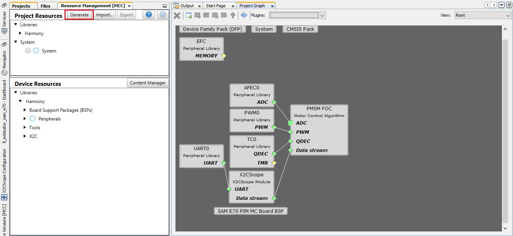

---
parent: Getting Started
grand_parent: Motor Control Plant Projects
title: Generate Code with MCC
nav_order: 6
has_children: false
has_toc: false
--- 

# Generate code with MCC

Click on the generate button to generate the code.

