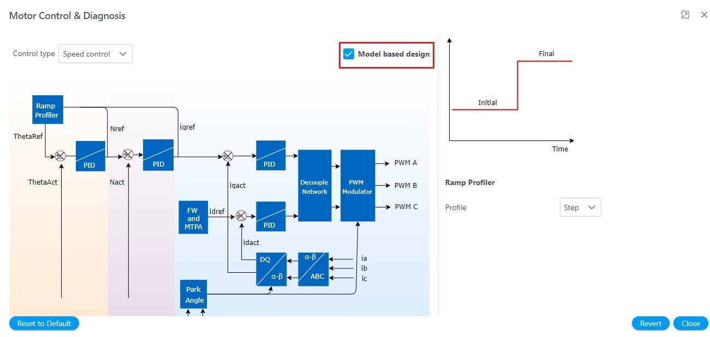
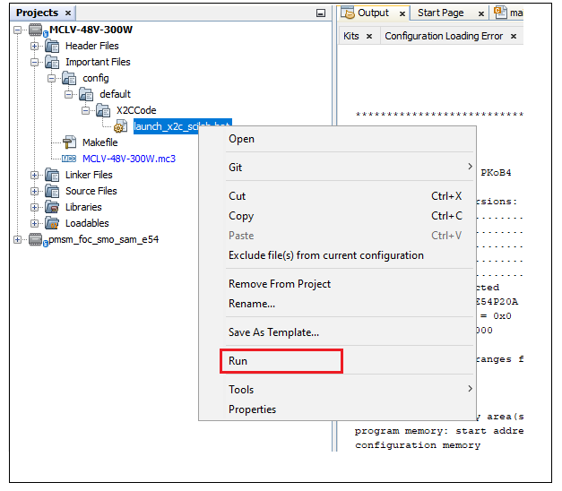
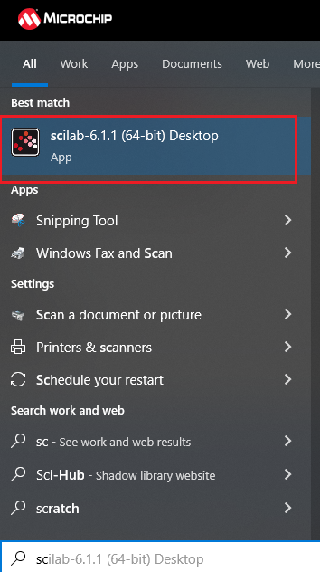

## Steps to Utilize Model-Based Design in Harmony QSpin

Follow the following steps to utilize Model-Based Design in Harmony QSpin. 

*Note*: Presently, this support is available only for PIC32MK, SAME70, SAME54 and SAMRH707 device families.

### 1. Install X2C Library 
   - Refer to the [installation instructions](./readme_installing_x2c_library.md) to install the X2C library (if not already installed).

### 2. Configure Harmony QSpin GUI
   - Create MCC Harmony Project and configure the motor, peripherals, and hardware as mentioned in the [Getting Started](../introduction.md) section.

### 3. Navigate to the Motor Control and Diagnosis Block
   - Open Harmony QSpin GUI and navigate to the Motor Control and Diagnosis block.

<p align="center">
    
    <figcaption align="center">Open "Motor Control & Diagnosis" block</figcaption>
</p>

### 4. Enable Model-Based Development Option
   - Within the Motor Control and Diagnosis block, check the "Model Based Development" option. This setting instructs QSpin to generate wrapper files instead of code for motor control.

<p align="center">
    
    <figcaption align="center">Enable model-based design checkbox</figcaption>
</p>

### 5. Generate C Code from MCC
   - Use the Motor Control Center (MCC) to generate the C code necessary for your project.

<p align="center">
    
    <figcaption align="center">Generate MCC Harmony code</figcaption>
</p>

### 6. Launch Scilab for X2C-based Model-Based Design

#### Using a Batch File:
   - Navigate to the project explorer and locate the following path: `Important Files -> config -> default -> X2CCode`.
   - Find the file named `launch_x2c_scilab.bat`.
   - Right-click on `launch_x2c_scilab.bat` and select "Run" to launch Scilab automatically.

<p align="center">
    
    <figcaption align="center">Launch Scilab from batch file</figcaption>
</p>

#### Manual Steps:
   - Open Windows Explorer and manually launch Scilab.

<p align="center">
    
    <figcaption align= "center">Launch Scilab from Windows Explorer </figcaption>
</p>

   - Navigate to the X2C code directory within your project, ensuring that `X2CCode` is set as the root folder.
   - In this directory, locate the `initProject.sce` file and execute it to initialize the project in Scilab.

<p align="center">
    
    <figcaption align= "center">Launch Model from Scilab </figcaption>
</p>

### 7. Model Creation in X2C
   - Use X2C to create your model. For detailed instructions and guidance on model creation, transformation, and other relevant processes, refer to the following resources:
     - [X2C - Model based development and Code generation](https://x2c.lcm.at/)
     - [Scilab® and X2C Open-Source Tools for Motor Control Development](https://www.microchip.com/en-us/solutions/technologies/motor-control-and-drive/motor-control-simulations/scilab-and-x2c)
     - [Harmony X2C Model](https://github.com/Microchip-MPLAB-Harmony/x2c/tree/master/x2c-model#readme)

### 8. Transform and Generate Code
   - Click on "transform model and push to communicator".
   - Click on "Start Communicator".
   - Wait till you see "Model Set" in the log.
   - Click on "Create Code" button.
   - Transform your model in X2C and generate code as per your project requirements.

<p align="center">
    
    <figcaption align= "center">Transform and generate the code </figcaption>
</p>

*Note*: Your model name and files may differ from those shown in the figure, depending on your configuration, model, and version.

### 9. Update "readInports" and "writeOutports" Function Calls in MPLABX Project

- Open `mc_field_oriented_control.h` from `source->config->default->QSpin->Field_Oriented_Control`.
- Update readInports() and writeOutports as shown in the provided code snippet.

   Input Ports
   ````
        static inline void mcFoc_InputPortsRead( void  )
        {
          /** Please note that the ports may vary depending on your specific model. 
              Please adjust as needed. */
        #if ( X2CMODEL_TYPE == FLOATING_POINT_F32_MODEL )
            x2cModel.inports.bI_a = (float32_t)mcCurI_ModuleData_gds.dOutput.iABC.a;
            x2cModel.inports.bI_b = (float32_t)mcCurI_ModuleData_gds.dOutput.iABC.b;
            x2cModel.inports.bV_POT = mcHalI_Potentiometer_gdu16 - 2048;
            x2cModel.inports.bV_DCLINK = (float32_t)mcVolI_ModuleData_gds.dOutput.uBus;
        #endif

        #if ( X2CMODEL_TYPE == FIXED_POINT_Q15_MODEL )
           /** Scale phase currents
              * Scaling:
              *         Maximum measurable current -> 32767 units,
              *         Conversion Factor = 32767./ Maximum measurable current
              *
              *         For a MCLV-48V-300W board, maximum measurable current is 22 Amperes
              *         Therefore, conversion factor ~ 1,489.409
              */
            x2cModel.inports.bI_a = -(int16_t)((float32_t)mcCurI_ModuleData_gds.dOutput.iABC.a * (float32_t)1489.409);
            x2cModel.inports.bI_b = -(int16_t)((float32_t)mcCurI_ModuleData_gds.dOutput.iABC.b * (float32_t)1489.409);

            /**
                 Potentiometer scaling: [ 0 - 4095 ] -> [ -32768, 32767 ]
             */
            x2cModel.inports.bV_POT = (int16_t)( mcHalI_Potentiometer_gdu16  - 2048 ) << 3U;

           /** Scale DC link voltage
              * Scaling:
              *         Maximum measurable voltage -> 32767 units,
              *         Conversion Factor = 32767/ Maximum measurable voltage
              *
              *         For a MCLV-48V-300W board, maximum measurable voltage is 72.9 Volts
              *         Therefore, conversion factor ~ 449.478
              */
             x2cModel.inports.bV_DCLINK = (int16_t)((float32_t)mcVolI_ModuleData_gds.dOutput.uBus * (float32_t)449.478);
        #endif
        }
   ````

   Output ports:
   ````
        static inline void mcFoc_OutputPortsWrite( void  )
        {
          /** Please note that the ports may vary depending on your specific model. 
              Please adjust as needed. */
          #if ( X2CMODEL_TYPE == FLOATING_POINT_F32_MODEL )
            float32_t dutyCycleFactor;
            int16_t   periodCount;
            int16_t   halfPeriodCount;

            /* Get the period count from mcHalI_PwmPeriodGet() */
            periodCount = mcHalI_PwmPeriodGet();
           
            /* Calculate half of the period count */
            halfPeriodCount = periodCount >> 1U;
                 
            /* Calculate the duty cycle factor */
            dutyCycleFactor = (float)periodCount / mcVolI_ModuleData_gds.dOutput.uBus;
                 
            /* Update PWM duty cycles for three channels */
            mcPwmI_Duty_gau16[0] = periodCount - (halfPeriodCount + *x2cModel.outports.bPWM1 * dutyCycleFactor);
            mcPwmI_Duty_gau16[1] = periodCount - (halfPeriodCount + *x2cModel.outports.bPWM2 * dutyCycleFactor);
            mcPwmI_Duty_gau16[2] = periodCount - (halfPeriodCount + *x2cModel.outports.bPWM3 * dutyCycleFactor);
          #endif

          #if ( X2CMODEL_TYPE == FIXED_POINT_Q15_MODEL )
            uint16_t duty[3U];
            int16_t   periodCount;

            /* Get the period count from mcHalI_PwmPeriodGet() */
            periodCount = mcHalI_PwmPeriodGet();


            duty[0u] = (uint16_t)(((INT16_MAX - *x2cModel.outports.bPWM1) * periodCount)>>16);
            duty[1u] = (uint16_t)(((INT16_MAX - *x2cModel.outports.bPWM2) * periodCount)>>16);
            duty[2u] = (uint16_t)(((INT16_MAX - *x2cModel.outports.bPWM3) * periodCount)>>16);

            mcHalI_InverterPwmSet(duty);
          #endif
        }
   ````
### 10. Make and Program Device Project
   - Make and program the device project.

<p align="center">
    
    <figcaption align= "center">Make and program project </figcaption>
</p>

### 11. Verify X2C Communicator Communication
   - Click on "Start Communicator" (if not already open).
   - Setup Serial Port.
   - Click on "Connect to Target".

<p align="center">
    
    <figcaption align= "center">X2C Communicator </figcaption>
</p>

*Note*: Your model name and files may differ from those shown in the figure, depending on your configuration, model, and version.

### 12. Motor Operation, Variable Monitoring, and Tuning
   - Run the motor, monitor variables, and fine-tune your system parameters as needed for optimal performance.

