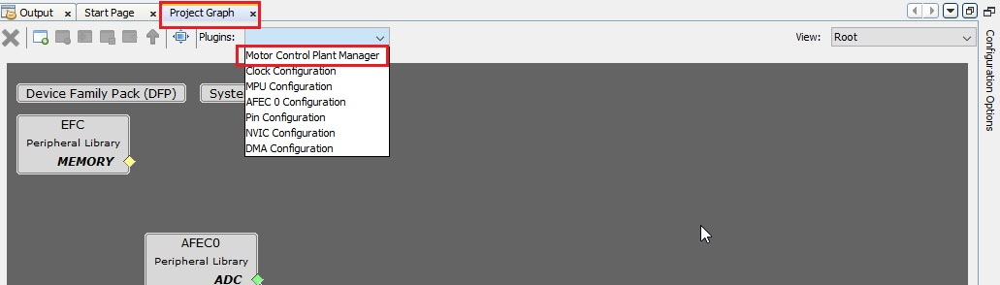

---
parent: Getting Started
grand_parent: Motor Control Plant Projects
title: MC Plant Manager
nav_order: 2
has_children: false
has_toc: false
--- 
<!-- Styling  -->

# Motor Control Plant Manager
The Motor Control Plant Manager (MCPM) is an intuitive graphical tool for developing motor control application software.

The following section briefly describes how to configure motor control firmware for a user application.

## How to configure Motor Control Application
1. Launch the Motor Control Plant Manager from the MCC plugin list.    
    

    
    <figcaption align= "center">Figure.1 - Launching Motor Control Plant Manager </figcaption>
    

2. Set the motor and board parameters.
    

        
        <figcaption align= "center">Figure.2 - Motor and Board Parameters </figcaption>
    

    [Click here for details](hardware_modules.md)
 
3. Set the microcontroller peripherals.        
    

        
        <figcaption align= "center">Figure.3 - Microcontroller Peripherals </figcaption>
    

    [Click here for details](peripheral_modules.md)

4. Set the software modules.   
    

        
        <figcaption align= "center">Figure.4 - Software modules </figcaption>
    

    [Click here for details](software_modules.md)

5. Set advanced project options.
   
    

        
        <figcaption align= "center">Figure.5 - Advanced options </figcaption>
    

