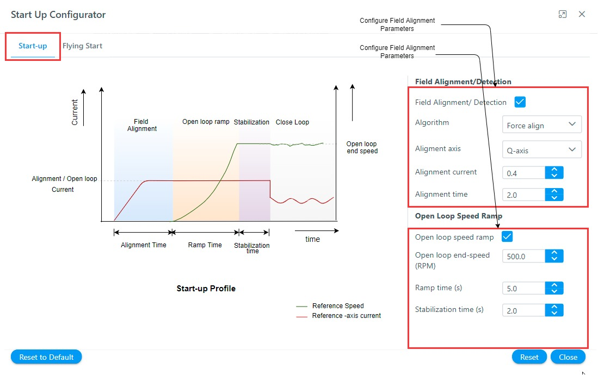

---
parent: Getting Started
grand_parent: Motor Control Plant Projects
title: Software Modules
nav_order: 5
has_children: false
has_toc: false
--- 
<!-- Styling  -->

# Configure software modules
The **MC Plant** provides end users to configure the motor control software modules as per their project requirements. 

For convenience, the motor control software is divided into following modules:
- Start-up Configurator
- Motor control and diagnosis
- Output Stage and diagnosis
- Current measurement and diagnosis
- Voltage measurement and diagnosis
- Rotor position calculation and diagnosis

Each of the above-mentioned modules has their own set of configuration options. The following section describes the different configuration options for the software modules.

## Start-up Configurator
The sensorless position estimation techniques based on back-EMF require a minimum value of back EMF to estimate the electrical position of the rotor. The open-loop start-up procedure drives the PMSM till its speed reaches the minimum value where the back EMF values are large enough to estimate the rotor position.
In the open-loop start-up procedure, the speed loop is de-activated.  The currents are controlled directly in the dq reference frame by using assumed rotor position angles for transformations. 
The complete start-up procedure can be divided into following phases:

- **Initial Field Alignment**. In this phase, the PMSM rotor is locked to a specified rotor position by keeping a fixed rotor position angle. The d-axis or q-axis current is gradually ramped to the a specified value to avoid any over-current issues. 

- **Open-loop Ramp**. In this phase, the rotor position is constantly incremented based on user-defined ramp time to achieve the minimum required speed for the BEMF observer. The minimum ramp time and speed depend on PMSM drive electrical and mechanical parameters. This stage is the most critical step. Any mistuning of reference speed and acceleration can lead to start-up failure.

- **Stabilization**. In this phase, the PMSM is allowed to rotate at a constant open-loop speed. This step ensures a smooth transition to close loop mode.

Figure 1 shows a complete start-up procedure for a sensorless PMSM motor drive:

  
  <figcaption align= "center">Figure.1 - Open-loop Start-up Procedure </figcaption>

In **MC Plant** the start-up configurator can be configured in following simple steps:
- Click on the "Start-up Configurator" block as shown below.
    

        
        <figcaption align= "center">Figure.2 - Open loop start-up module </figcaption>
    

- Configure the open loop start
    

        
        <figcaption align= "center">Figure.2 - Open-loop Start-up Configuration </figcaption>
    

- Configure flying start
    

        
        <figcaption align= "center">Figure.3 - Flying Start Configuration </figcaption>
    

## Motor control and diagnosis
The **Motor control and diagnosis** module is responsible for the implementation of core motor control algorithm. It implements the motor control state machine, and the core control parameters. For details refer [Software Architecture](theory/software_architecture.md).

In **MC Plant** the **Motor control and diagnosis** module can be configured in following simple steps:

- Click on the "Motor control and diagnosis" block as shown below.
    

        
        <figcaption align= "center">Figure.4 Motor Control and Diagnosis module </figcaption>
    

- Select the appropriate control type from dialog box
    

        
        <figcaption align= "center">Figure.5 - Motor Control and Diagnosis module configuration </figcaption>
    

- Click on the module blocks to configure the same.

## Output Stage and diagnosis
- Click on the "Output stage and diagnosis" block as shown below.
    

        
        <figcaption align= "center">Figure.6 - Output Stage and Diagnosis module </figcaption>
    

- Configure output stage parameters
    

        
        <figcaption align= "center">Figure.7 - Output Stage and Diagnosis module configuration </figcaption>
    

## Current measurement and diagnosis
The **Current measurement and diagnosis** module is responsible for the implementation of motor current measurement technique required for the motor control application. For details refer [Software Architecture](theory/current_measurement.md).

In **MC Plant** the **Current measurement and diagnosis** module can be configured in following simple steps:
- Click on the "Current measurement and diagnosis" block as shown below.
    

        
        <figcaption align= "center">Figure.8 - Current Measurement and Diagnosis module </figcaption>
    

- Configure current measurement parameters
    

        
        <figcaption align= "center">Figure.9 - Current Measurement and Diagnosis module configuration </figcaption>
    

## Voltage measurement and diagnosis
The **Voltage measurement and diagnosis** module is responsible for the implementation of motor voltage measurement technique required for the motor control application. 

In **MC Plant** the **Voltage measurement and diagnosis** module can be configured in following simple steps:
- Click on the "Voltage measurement and diagnosis" block as shown below.
    

        
        <figcaption align= "center">Figure.10 - Voltage Measurement and Diagnosis module  </figcaption>
    

- Configure voltage measurement parameters
    

        
        <figcaption align= "center">Figure.11 - Voltage Measurement and Diagnosis module  configuration </figcaption>
    

## Rotor position calculation and diagnosis
The **Rotor position calculation and diagnosis** module is responsible for the implementation of rotor position measurement technique required for the motor control application. For details refer [Rotor Position Measurement](theory/rotor_position_measurement.md)

In **MC Plant** the **Rotor position calculation and diagnosis** module can be configured in following simple steps:
- Click on the "Rotor position calculation and diagnosis" block as shown below.
    

        
        <figcaption align= "center">Figure.12 - Rotor position calculation and diagnosis module </figcaption>
    

- Select the rotor position algorithm
    

        
        <figcaption align= "center">Figure.13 - Rotor position calculation and diagnosis module configuration </figcaption>
    

- Configure the rotor position algorithm

