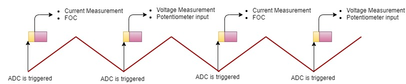
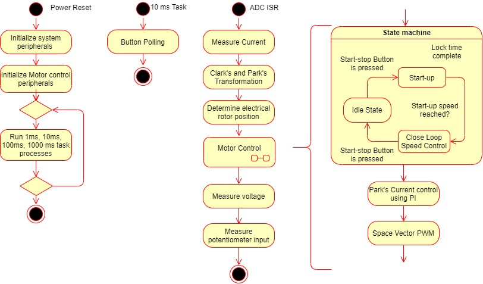
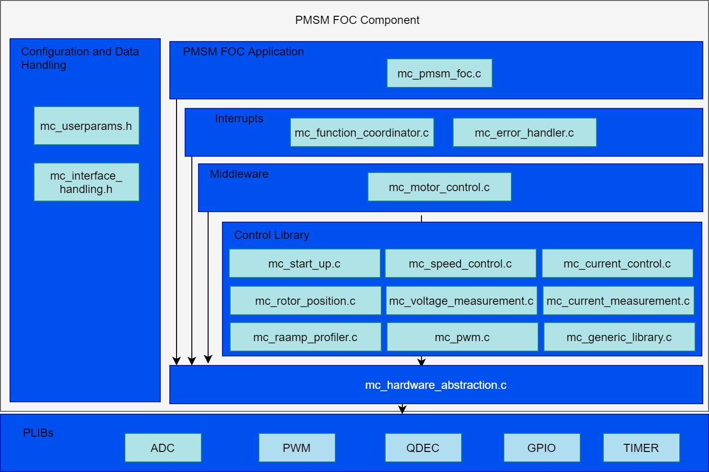

---
parent: PMSM FOC Component
grand_parent: Microchip MPLAB® Harmony 3 Motor Control
title: Software Design
nav_order: 1
has_children: false
has_toc: false
---

## Software Design
### SAMC21 and PIC32CM MC
-   PMSM FOC Control loop is implemented in the ADC result ready interrupt. Refer to the flow chart given below. 
-   ADC channel conversion is triggered by the PWM overflow/zero match event. This trigger point could vary based on the current measurement techniques and MCU PWM IP implementation.
-   For bandwidth constraints, the FOC is executed every alternate PWM cycle
-   Slow loop task is executed in every 10ms in the task process. Polling of switches for user inputs is handled in the slow loop task. 

### Timing Diagram

### Flow Chart

### State Machine

-   **Idle**:

In this state, control waits for the switch press. 

-   **Field Alignment**:

Rotor is aligned to known position at D-axis or Q-axis by applying a pre-defined value of the current for a pre-defined length of time. The magnitude of the current and the length of the time for which it is applied depends upon the electrical and mechanical time constant of the PMSM motor drive. Electrical time constant of the motor is a function of R and L values of the motor windings, whereas the mechanical time constant of the motor drive is primarily a function of the static load on the motor shaft. 

-   **Open Loop**:

This state is applicable to sensorless position feedback methods. In this state, the speed of the PMSM motor is gradually ramped up using an open loop control. During this mode, the rotor angle is derived from the asserted open loop speed reference. This derived rotor angle would be lagging from the actual rotor angle. The speed is ramped up linearly to a minimum value required for the PLL estimator to estimate the electrical speed of the PMSM motor with sufficient accuracy. Rotor angle information is obtained by integrating the estimated electrical speed of the motor. 

-   **Closed Loop**:

Control switched to closed loop and rotor angle is obtained from the configured position feedback method. 

### Code Structure

Configurations: 
-   mc_userparameters.h contains the user configurations. 

PMSM FOC Application: 
-   mc_pmsm_foc.c/h - PMSM FOC algorithm interface file 

Interrupts: 
-   mc_function_coordinator.c - Initializes and coordinates motor control ISR and slow task processes
-   mc_error_handler.c - PWM fault ISR to take corrective action on over-current 

Control Middleware: 
-   mc_motor_control.c/h - Implements the motor control state machines.

Control library: 
-   mc_start_up.c/h - Implements the initial field alignment and open loop start-up profile.
-   mc_speed_control.c/h - Calculate and regulates the reference speed
-   mc_current_control.c/h - Controls the direct and quadrature axis currents
-   mc_rotor_position.c/.h - Calculate the position and speed of the rotor 
-   mc_voltage_measurement.c/h - Get the DC Bus voltage 
-   mc_current_measurement.c/h - Get the motor phase currents 
-   mc_interface_handling.c/h - Manages global variables and data-types
-   mc_generic_library.c/h - FOC library 
-   mc_pwm.c/h - Space Vector modulation (SVM) and updating PWM duty cycles 
-   mc_ramp_profiler.c/h - Speed reference profiles for user inputs 

HAL: 
-   mc_hardware_abstraction.c/h - Hardware Abstraction Layer to interact with PLIBs 

