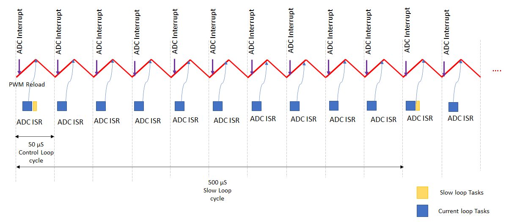

## Software Design

-   PMSM FOC Control loop is implemented in the ADC result ready interrupt. Refer to the flow chart given below. 
-   ADC channel conversion is triggered by the PWM overflow/zero match event. This trigger point could vary based on the current measurement techniques and MCU PWM IP implementation.
-   ADC interrupt frequency depends on the PWM frequency.
-   Slow loop task is executed 10 times slower than ADC interrupt. Polling of switches for user inputs and reference speed calculation is handled in the slow loop task. 

### Timing Diagram

### Flow Chart

### State Machine

-   **Idle**:

In this state, control waits for the switch press. 

-   **Flying Start**:

In this state, the control algorithm detects if the motor is freewheeling. If the motor's freewheeling speed is above the minimum Flying Start Detect speed and in the same direction as the command direction, the state machine directly enters in to "Closed Loop" state. 

However, if the freewheeling speed is less than minimum Flying Start Detect speed, the control algorithm attempts to passive brake the motor by applying pulses of "NUll Vectors". 

If the freewheeling speed is more than the minimum Flying Start Detect speed but in the opposite direction of the command direction, the control algorithm attempts to active brake the motor by regenerative braking (if enabled). Once the motor speed falls below the minimum Flying Start Detect speed, the control algorithm attempts to passive brake the motor by applying pulses of "NUll Vectors". 

-   **Field Alignement**:

Rotor is aligned to known position at D-axis or Q-axis by applying a pre-defined value of the current for a pre-defined length of time. The magnitude of the current and the length of the time for which it is applied depends upon the electrical and mechanical time constant of the PMSM motor drive. Electrical time constant of the motor is a function of R and L values of the motor windings, whereas the mechanical time constant of the motor drive is primarily a function of the static load on the motor shaft. 

-   **Open Loop**:

This state is applicable to sensorless position feedback methods. In this state, the speed of the PMSM motor is gradually ramped up using an open loop control. During this mode, the rotor angle is derived from the asserted open loop speed reference. This derived rotor angle would be lagging from the actual rotor angle. The speed is ramped up linearly to a minimum value required for the PLL estimator to estimate the electrical speed of the PMSM motor with sufficient accuracy. Rotor angle information is obtained by integrating the estimated electrical speed of the motor. 

-   **Closing Loop**:

In this state, control waits for stabilization time. 

-   **Closed Loop**:

Control switched to closed loop and rotor angle is obtained from the configured position feedback method. 

### Code Structure

Configurations: 
-   mc_userparameters.h contains the user configurations. 
-   mc_derivedparameters.h contains the calculated values used in the code. 
-   mc_pmsm_foc_common.h - common data structures and defines 

PMSM_FOC: 
-   mc_pmsm_foc.c/h - PMSM FOC algorithm interface file 

Interrupts: 
-   mc_control_loop.c - Control loop is implemented in the ADC result ready ISR. 
-   mc_errorhandler.c - PWM fault ISR to take corrective action on over-current 

Control library: 
-   mc_lib.c/h - FOC library 
-   mc_picontroller.c/h - PI controller implementation 
-   mc_pwm.c/h - Space Vector modulation (SVM) and updating PWM duty cycles 
-   lib_mc_flyingstart.a - Flying Start Control Library

Control Middleware: 
-   mc_speed.c/h - Calculate the reference speed 
-   mc_rotorposition.c/.h - Calculate the position and speed of the rotor 
-   mc_voltagemeasurement.c/h - Get the DC Bus voltage 
-   mc_currentmeasurement.c/h - Get the motor phase currents 

HAL: 
-   mc_hal.h - Hardware Abstraction Layer to interact with PLIBs 

