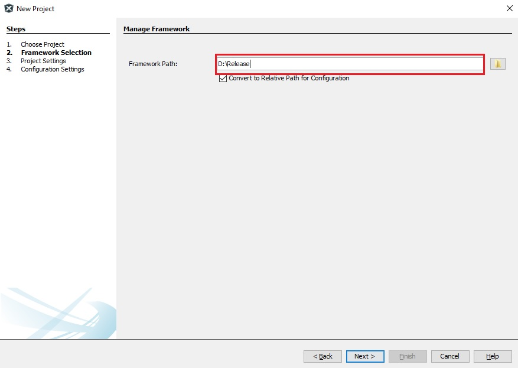
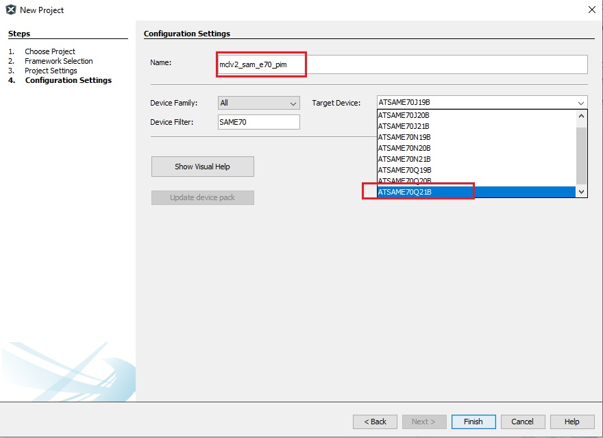

# Create a new MPLAB® Harmony v3 project using MCC

This section describes step by step process for creating a new Motor Control Project using MPLAB Code Configurator (MCC) from scratch. 

**Procedure**
The following section describes uses SAME70 microcontroller to illustrate the process for creating a new motor control project with Harmony Qspin.

1. Launch MPLAB® X IDE from the Microsoft Windows® Start menu. 
2. Go to the **File** option in the menu bar and select "**New project**"
3. In the Categories pane of the New Project dialog, select Microchip Embedded. In the Projects pane, select 32-bit MCC Harmony Project, then click Next.
4. In the Framework Path edit box, browse to the folder where you downloaded the framework. 

5. In the Project Settings window, apply the following settings:
    - **Location**: Indicates the path to the root folder of the new project. All project files will be placed inside this folder. The project location can be any valid path, for example: <Folder of your choice>\dev\same51n_getting_started.
    - **Folder**: Indicates the name of the MPLABX .X folder. Enter "sam_e51_cnano" to create a sam_e51_cnano.X folder.

    - **Name**: Enter the project’s logical name as "getting_started_sam_e51_cnano". This is the name that will be shown from within MPLAB X IDE.

    - Click Next to proceed to Configuration Settings.

6. Follow the steps below to set the project’s Configuration Settings.

    - **Name**: Enter the configuration name as "mclv2_sam_e70_pim".

    - **Target Device**: Select ATSAME70Q21B as the target device.
	

7. In MCC Content Manager Wizard window, click on "**Select MPLAB Harmony**"

8. In MCC Content Manager Wizard window, click on "**Finish**"

	

9. Add MCC components from the ** Device Resources** to the **Project Graph**
    - Add **PMSM FOC** component
    - Add and connect **ADC**, **PWM**, **QDEC** and **Data Stream** dependencies to **PMSM FOC**
    - Add **SAM E70 PIM MC Board** from the **Board Support Packages**

	
	
10. Launch **Qspin Motor Control Configuration** plugin