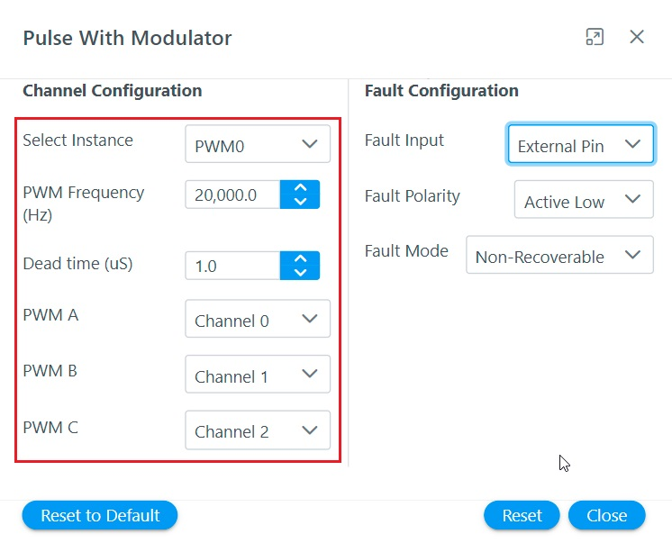

# Configuring Peripheral Modules
This section describes how to configure MCU peripherals for motor control application projects with Harmony Qspin

**Setting PWM Interface**
The following section describes the PWM interfaces and how it can be configured using Harmony Qspin.

**Theoretical Background**
The three-phase actuation voltage is applied employing the Space Vector Pulse Width Modulation (SVPWM). 

Figure shows a conceptual diagram of Analog to digital conversion.

The software essentially has to perform following tasks:
- Set the PWM unit and channels to be used to modulate three-phase voltages 
- Configure PWM peripheral's frequency, dead-time, fault management etc.

**Configuring PWM Interface using Harmony Qspin**
In Motor Control Plant PWM Interface can be set in following steps.

1. Launch **PWM Interface** by clicking on the block

2. Configure PWM interface 
    

**Setting Position Interface**
The following section describes the position interfaces and how it can be configured using Harmony Qspin.

**Theoretical Background**
For sensored Field Oriented Control, the position sensor interface has to be configured to process rotor position signals.

The software essentially has to perform following tasks:
- Set the peripheral unit and channels to be used to for rotor position signals
- Configure rotor position interface peripheral.

**Configuring Position Interface using Harmony Qspin**

1. Launch **Position Interface** by clicking on the block

2. Configure PWM interface

    

