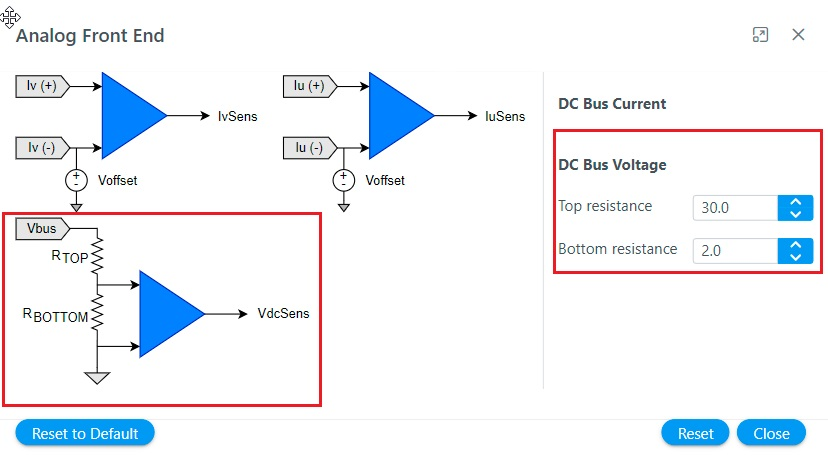

# Setting Hardware Modules
This section describes how to set-up hardware modules for motor control application project with Harmony QSpin.

**Configure PMSM parameters**
The PMSM parameter can be configured in following simple steps:

1.  Click on the motor block to open PMSM parameter window as shown below.

2. Configure the motor parameters as shown below.

3. Close the window 
**Configure Development Board**
There are two ways by which the motor control board can be configured.
1. By selecting the board from the list of Microchip's development boards and reference designs.
2. By configuring the board Parameters from scratch.

**Microchip's Development Board and Reference Designs**
Microchip offers a number of motor control development boards and reference designs. These boards can be selected from **Quick Settings** logo to use these boards for developmental activities. 

Following steps list the procedure to select the Harmony Qspin supported development board and reference design.

- Click on the "Quick setting" icon as shown below.

- Select appropriate motor from "Select Board" option as shown below.

**Setting Board Parameters from Scratch**
The Harmony Qspin can be used to configure the board parameters from scratch. Following steps list the procedure to configure the board parameters from scratch.

**Setting Analog Front End **
The following section describes various analog front end circuit and how it can be configured using Harmony Qspin.

** Theoretical Background**
The Field Oriented Control of an AC motor requires current, voltage and rotor position information. These signals are processed using analog circuits before it is sent to the microcontroller to be used for the control tasks. The control software has to be cognizant of these analog circuit parameters in order to reconstruct the actual analog signal for control operation.

** Phase Current Measurement**
There are a number of other ways of measuring the phase currents. For brief introduction refer [Current Measurement in AC motor drives](current_measurement.md). 

**DC Bus Voltage Measurement**
The DC bus voltage is usually measured by using a resistor based potential divider.
 
 

**Configuring Analog front End with Harmony Qspin**
In Harmony Qspin analog parameters can be set in following steps.

1. Launch **Analog Front End** by clicking on the block

    

2. Configure **Phase A** current measurement analog circuit parameters by clicking on the IaSens icon.

    

2. Configure **Phase B** current measurement analog circuit parameters by clicking on the IbSens icon.

    

2. Configure **DC Bus** current measurement analog circuit parameters by clicking on the VdcSens icon.

    

**Setting Analog Interface**
The following section describes the analog interfaces and how it can be configured using Harmony Qspin.

** Theoretical Background**
The analog signals has to be converted to digital signals for the microcontroller devices to use. For Field Oriented control, the analog signals are converted to corresponding digital signals using ADCs. 

The software essentially has to perform following tasks:
- Set the ADC unit and channel to be used to convert analog signals to digital signals
- Configure ADC parameters like resolution, trigger source etc.

**Configuring Analog Interface using Harmony Qspin**
In Harmony Qspin analog parameters can be set in following steps.

1. Launch **Analog Interface** by clicking on the block

    

2. Configure analog interface **Group 01** signals, i.e. phase current A and phase current B by clicking on **Group 01** icon

    

3. Configure analog interface **Group 02** signals, i.e. DC bus voltage and potentiometer by clicking on **Group 02** icon

    

