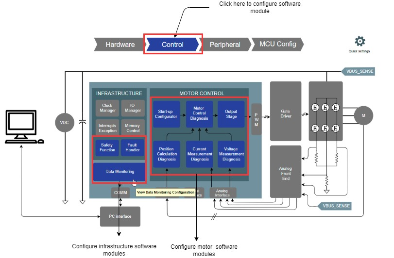

# Harmony QSpin Motor Control Configuration
The Harmony QSpin is an intuitive graphical tool for developing motor control application software.

The following section briefly describes how to configure motor control firmware for a user application.

## How to configure Motor Control Application
1. Launch the QSpin Motor Control Configuration from the MCC plugin list.    

2. Set the motor and board parameters.

	

 
3. Set the microcontroller peripherals.        

	

4. Set the software modules.   

	

5. Set advanced project options.
   

	
