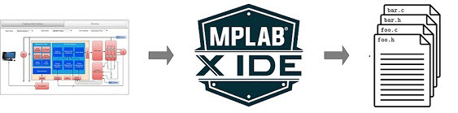

# Harmony QSpin Motor Control 

**Introduction**
The Harmony QSpin Motor Control Configuration is an extension of the MPLAB® ecosystem for developing Microchip’s next-generation application firmware for motor control on Microchip® 32-bit devices. 

It has a graphical tool that enables an effortless configuration and generation of motor control application C code for Microchip 32-bit devices. 

This document introduces the readers to the basics of an PMSM based electric motor drive, and how **Motor Control Plant** can be used to quickly their own motor control application firmware. 

**Electrical Motor Drive**

- [Software Design and Architecture ](GUID-3D21A744-D128-4A47-ACAF-BDE8FF6807FB.md)
 

**Getting Started**
This section briefly describes the basic steps to get started with the **Qspin Motor Control **. It consists of following steps:

- [Create a new MPLAB® Harmony v3 project using MCC](GUID-4BC354C1-6447-4A73-BF2C-3672A39E45FF.md)
- [Configure motor control firmware using Motor Control Plant Manager](GUID-C24E103D-6B6E-4B10-9125-F8A8447035B0.md)
- [Generate the source code](GUID-35094575-C2AE-491B-B8DB-85D7198458CB.md)

