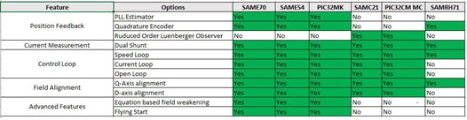

# PMSM FOC

PMSM_FOC component provides Field Oriented Control (FOC) algorithm for Permanent Magnet Synchronous Motor (PMSM). 
This component supports speed control with an inner current control loop to control motor speed and motor current. It also supports current control and open loop mode. Rotor position estimation techniques are configurable in the UI. 

PMSM_FOC connects to the Peripheral Libraries (PLIBs) from CSP repository and X2CScope component from X2C repository. 

This component depends on ADC PLIB for phase current measurement, DC bus voltage and potentiometer measurement. PWM PLIB is used to generate three phase signals to control the motor. For quadrature encoder sensor position feedback, PMSM_FOC interacts with QDEC peripheral. 

In addition to the generation of code, it also provides back-end support for **Harmony QSpin Motor Control**.

**Supported Microcontrollers and Development Boards**

| Microcontroller     | MCLV2  | MCHV3                                               |
|------------| ---------------| -----------------------------------------------------------|
| SAME70       | Yes              | Yes |
| SAME54        | Yes      | Yes |
| SAMC21   | Yes | Yes |
| PIC32MK MCF       | Yes  | Yes |
| PIC32MK MCM   | Yes | Yes |
| PIC32CM MC  | Yes | Yes |

**Harmony QSpin Motor Control**
The **Harmony QSpin** is an extension of the MPLAB® ecosystem for developing Microchip’s next-generation application firmware for motor control on Microchip® 32-bit devices. 

It has a graphical tool that enables an effortless configuration and generation of motor control application C code for Microchip 32-bit devices. 

The details of the tool is available at [Harmony QSpin](GUID-C79D218F-74E3-4A96-AD8E-19AAABAAB5E1.md).

The following table summarizes the supported Microchip's 32-bit MCUs in Harmony QSpin:

|Device Families |   Links     |
|----------------|-------------| 
| PIC32MK        |    [PIC32MK Family](https://www.microchip.com/en-us/products/microcontrollers-and-microprocessors/32-bit-mcus/pic32-32-bit-mcus/pic32mk)     |
| SAM E5x        |    [SAME5x Family](https://www.microchip.com/en-us/products/microcontrollers-and-microprocessors/32-bit-mcus/sam-32-bit-mcus/sam-e)     |
| SAM E7x        |    [SAME7x Family](https://www.microchip.com/en-us/products/microcontrollers-and-microprocessors/32-bit-mcus/sam-32-bit-mcus/sam-e)     |

## PMSM FOC Component for devices without Harmony QSpin support
This section describes the software design, algorithm and configuration options for those devices which do not have **QSPin** support yet.

The following table shows the supported features with PMSM FOC Component.

[Software Design](sw_design.md)

[Control Algorithm](control_algorithm.md)

[Configuring the Library](configurations.md)

[Using the Library](using_the_library.md)

