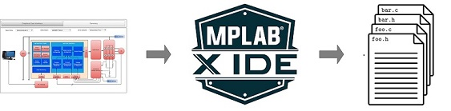

---
title: Motor Control Plant Projects
nav_order: 3
has_children: true
has_toc: false
--- 

#  Harmony QSpin Motor Control

## Introduction
The QSpin Motor Control Configuration referred as **Harmony Qspin" is an extension of the MPLAB® ecosystem for developing Microchip’s next-generation application firmware for motor control on Microchip® 32-bit devices. 

It has a graphical tool that enables an effortless configuration and generation of motor control application C code for Microchip 32-bit devices to quickly spin (Qspin) the motor. 
    

        
        <figcaption align= "center"> System Diagram </figcaption>
    

This document introduces the readers to the basics of an PMSM based electric motor drive, and how **Harmony QSpin** can be used to quickly develop their own motor control application firmware. 

## Electrical Motor Drive

- [Permanent Magnet Synchronous Motor](theory/pmsm_motor.md)
- Field Oriented Control (FOC)
    - [Field Oriented Control Theory](theory/field_oriened_control.md)
    - [Current Measurement Principles](theory/current_measurement.md)
    - [Rotor Position Measurement Principles](theory/rotor_position_measurement.md)

- [Software Design and Architecture ](theory/software_architecture.md)
 

## Getting Started
This section briefly describes the basic steps to get started with the **Harmony Qspin**. It consists of following steps:

- [Create a new MPLAB® Harmony v3 project using MCC](mc_plant/create_mc_project_with_mcc.md)
- [Configure motor control firmware using Qspin Motor Control Configuration](mc_plant/qspin_motor_control_configuration.md)
- [Generate the source code](mc_plant/generate_mc_code_with_mcc.md)

## X2C Model based Design in Harmony QSpin
Harmony QSpin allows seamless integration of X2C model based code with the QSpin code enabling user can leverage the power of model based
tools for simulation and algorithm development. Get started with [X2C Model based Design in Harmony QSpin](mc_plant/launch_scilab_for_x2c.md).

## Spin your motor with Custom motor option in QSpin:
The Custom Motor option in QSpin allows you to input your specific motor parameters, enabling you to spin your motor using the diverse algorithms available in QSpin. 
Follow this [steps](mc_plant/use_custom_motor_option) to use custom motor option in QSpin.