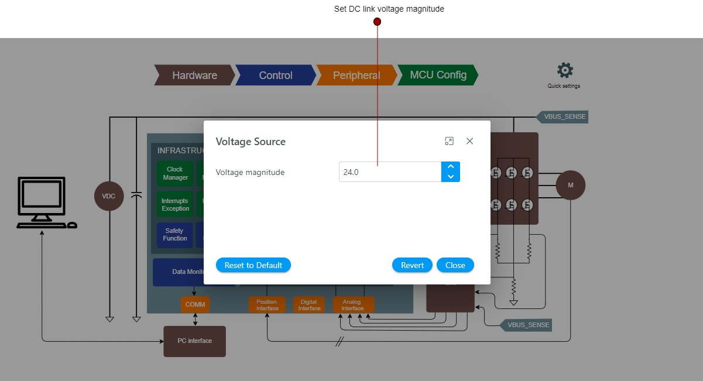

# Setting up Voltage Source
This document provides guidance on setting up voltage source module with Harmony QSpin.
 
## Voltage source Graphical User Interface

## Steps for Setup
In Harmony QSpin voltage source can be set in following steps.
1. Set the following fields
| Fields |  Description |
|---------|----------------|
| Voltage magnitude | Set the DC bus voltage to which the three phase inverter is connected |