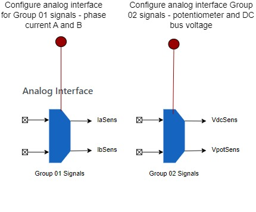

# Setting Analog Interface
Field-Oriented Control (FOC) involves controlling the stator currents of a motor to produce a rotating magnetic field, 
which in turn controls the rotor's position and speed. For more details, refer to [Field Oriented Control](../../theory/field_oriened_control.md).

Proper configuration of the analog interface settings is crucial for the effective implementation of FOC. 
Harmony QSpin allows users to configure these analog interface channels in just a few steps.

## Analog Signal Groups

The analog signals interfaced with the system are categorized into two main groups:

- **Group 01:** Phase A and Phase B current.
- **Group 02:** DC bus voltage and an optional potentiometer signal.

QSpin allows users to select the ADC instance and channel for each signal, with a forced 12-bit resolution and backend interrupt settings optimized for FOC (Field-Oriented Control) operation.

If a different resolution is required, users can manually configure the settings through the ADC PLIB (Peripheral Library Interface).

The following section provides a detailed guide on how to properly set up these signals, including descriptions of the different fields and configuration options.

## Analog Interface Graphical User Interface
The graphical user interface for the analog signal setup is displayed as follows:

## Steps for Signal Setup

To correctly set up the analog signals, follow these steps:

## Steps for Signal Setup

To correctly set up the analog signals, follow these steps:

1. **Configure Group 01 Signals:** Set the fields for Phase A and Phase B current as per your project requirements.

   |   Field                |       Description                                 |
   |------------------------|---------------------------------------------------|
   | **Signal A Configuration**                                                 |
   | Signal Name            | IA (Phase A current tag )                              |
   | ADC unit               | Select the ADC instance for Phase A current       |
   | ADC channel            | Select the ADC channel for Phase A current        |
   | **Signal B Configuration**                                                 |
   | Signal Name            | IB (Phase B current tag )                              |
   | ADC unit               | Select the ADC instance for Phase B current       |
   | ADC channel            | Select the ADC channel for Phase B current        |

2. **Configure Group 02 Signals:** Set the fields for DC bus voltage and the optional potentiometer as per your project requirements.

   |   Field                |       Description                                 |
   |------------------------|---------------------------------------------------|
   | **Signal A Configuration**                                                 |
   | Signal Name            | VDC (DC bus voltage tag )                              |
   | ADC unit               | Select the ADC instance for DC bus voltage        |
   | ADC channel            | Select the ADC channel for DC bus voltage         |
   | **Signal B Configuration**                                                 |
   | Signal Name            | VPOT (Potentiometer signal tag )                       |
   | ADC unit               | Select the ADC instance for the potentiometer     |
   | ADC channel            | Select the ADC channel for the potentiometer      |

<image placement="break" href="GUID-F750651E-C3DB-4D7D-BF7A-C0B7A95351B4" align="center" id="" />