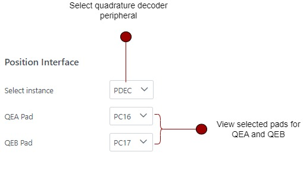

# Setting Position Interface
Field-Oriented Control (FOC) involves alignment of rotor magnetic flux with respect to stator's magnetic field.
For more details, refer to [Field Oriented Control](../../theory/field_oriened_control.md).

In sensored FOC, it is crucial to properly configure the position interface peripherals to measure the rotor position correctly.
Harmony QSpin allows users to configure quadrature decoder peripheral ( if available ) in few simple steps.

The following section provides a detailed guide on how to properly set up position interface, 
including descriptions of the different fields and configuration options.

## Position Interface Graphical User Interface
The graphical user interface for the analog signal setup is displayed as follows:



## Steps for Signal Setup
To correctly set up the position interface, follow these steps:
1. Select the Quadrature Decoder Instance 
2. Select the QEA and QEB pads to which the quadrature encoder signals are interfaced.

| Fields |  Description |
|---------|----------------|
| Select Instance |   Select the quadrature decoder instance |
| QEA pad | Select the QEA pad |
| QEB pad | Select the QEA pad |

**Note**: You need to configure the QEA and QEB pads in the **Pin Manager**. Navigate to project ```graph -> plugins -> Pin Configuration```

