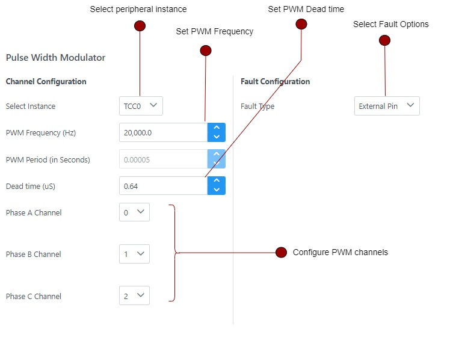

# Setting PWM Interface
**Field-Oriented Control (FOC)** involves generating three-phase voltages to create stator flux, which interacts 
with the rotor flux to produce motor torque. For more details, refer to [Field Oriented Control](../../theory/field_oriened_control.md).

The generation of three-phase voltages is achieved through PWM (Pulse Width Modulation) modulation. 
QSpin simplifies the configuration of the PWM peripheral through a straightforward setup process.

The following section provides a comprehensive guide on configuring the position interface, including detailed descriptions 
of the various fields and configuration options.

## PMW Interface Graphical User Interface
The graphical user interface for the PWM interface is displayed as follows:

## Steps for Signal Setup
In Harmony Qspin PWM Interface can be set in following steps.
1. Select the PWM Instance 
2. Set the following configuration of PWM peripheral.

| Fields |  Description |
|---------|----------------|
| Select Instance |   Select the quadrature decoder instance |
| PWM Frequency ( Hz ) | Set PWM frequency in Hertz |
| PWM Period ( in seconds ) | View PWM period in seconds |
| Dead Time ( uS ) | Set dead time in microseconds |
| Phase A channel | Select channel for phase A voltage |
| Phase B channel | Select channel for phase B voltage |
| Phase C channel | Select channel for phase C voltage |

3. Set fault configurations

| Fields |  Description |
|---------|----------------|
| Fault Type | Select faul type - external pin or internal fault |
