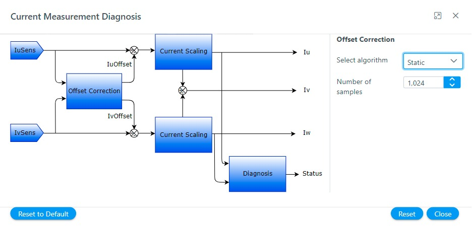

# Current Measurement and Diagnosis
Current sensing in Field-Oriented Control (FOC) is a critical process that involves measuring the motor's phase currents to accurately control the torque and speed of the motor. 
For more details refer [Current Measurement Principles](../../theory/current_measurement.md)

The **Harmony QSpin** platform allows end users to customize motor control software modules to fit their specific project requirements. 
Currently, the platform supports only the 'Dual Shunt' current measurement method for current sensing.

## Configuration Options:
In **Harmony Qspin** the **Current measurement and diagnosis** module can be configured in following simple steps:
- Click on the "Current measurement and diagnosis" block as shown below.
    

        
        <figcaption align= "center">Figure.1 - Current Measurement and Diagnosis module </figcaption>
    

- Configure current measurement parameters
    

        
        <figcaption align= "center">Figure.2 - Current Measurement and Diagnosis module configuration </figcaption>
    

