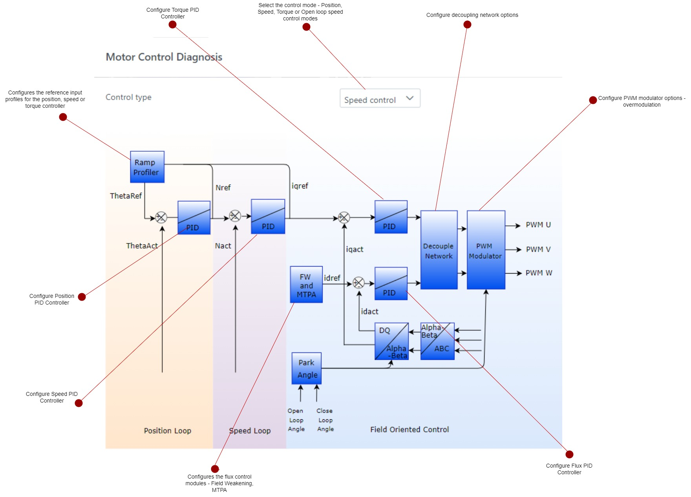

# Configure software modules
The **Harmony QSpin** provides end users to configure the motor control software modules as per their project requirements. 

## Motor control and diagnosis
The **Motor control and diagnosis** module is responsible for the implementation of core motor control algorithm. It implements the motor control state machine, and the core control parameters. For details refer [Software Architecture](theory/software_architecture.md).

In **Harmony Qspin** the **Motor control and diagnosis** module can be configured in following simple steps:

- Click on the "Motor control and diagnosis" block as shown below.
    

        
        <figcaption align= "center">Figure.4 Motor Control and Diagnosis module </figcaption>
    

- Configure the 'Motor Control & Diagnosis' blocks as indicated below. 
    

        
        <figcaption align= "center">Figure.5 - Motor Control and Diagnosis module configuration </figcaption>
    

- Click on the module blocks to configure the same.

## Motor Control & Diagnosis Sub-Modules

### Control Mode Selection
- **Purpose**: Allows selection between various control modes such as torque, speed, and position control, depending on the application requirements.
- **Key Features**: 
  - Supports multiple control modes.
  - Smooth transitions between modes.
  - Compatibility with custom motor parameters.

### Ramp Profiler
- **Purpose**: Provides smooth acceleration and deceleration of the motor to prevent sudden changes in speed that could cause mechanical stress or instability.
- **Key Features**: 
  - Configurable ramp rates.
  - Integration with speed and position controllers.

### Position PID Controller
- **Purpose**: Ensures precise position control of the motor by minimizing the error between the desired and actual position.
- **Key Features**: 
  - Tuning parameters: Proportional, Integral, and Derivative gains.
  - Fine control over position adjustments.

### Speed PID Controller
- **Purpose**: Regulates the speed of the motor to match the desired setpoint, adjusting for variations in load and other disturbances.
- **Key Features**: 
  - Tuning parameters: Proportional, Integral, and Derivative gains.
  - Adaptive control strategies for enhanced performance under varying conditions.

### Flux PID Controller
- **Purpose**: Controls the magnetic flux in the motor to optimize torque production and efficiency.
- **Key Features**: 
  - Tuning parameters: Proportional, Integral, and Derivative gains.
  - Integration with Field Weakening (FW) and Maximum Torque Per Ampere (MTPA) algorithms.

### FW & MTPA
- **Purpose**: Implements Field Weakening and Maximum Torque Per Ampere strategies to extend the operating range of the motor and maximize efficiency.
- **Key Features**: 
  - Automatic switching between FW and MTPA modes.
  - Enhanced motor performance at high speeds and varying loads.

### Decouple Network
- **Purpose**: Decouples the interaction between flux and torque in the motor, improving control accuracy and system stability.
- **Key Features**: 
  - Reduction of cross-coupling effects.
  - Simplified control architecture for better performance.

### PWM Modulator
- **Purpose**: Generates Pulse Width Modulated (PWM) signals to control the power delivered to the motor, ensuring efficient and precise operation.
- **Key Features**: 
  - High-resolution PWM generation.
  - Adaptive modulation techniques for reduced harmonic distortion.
