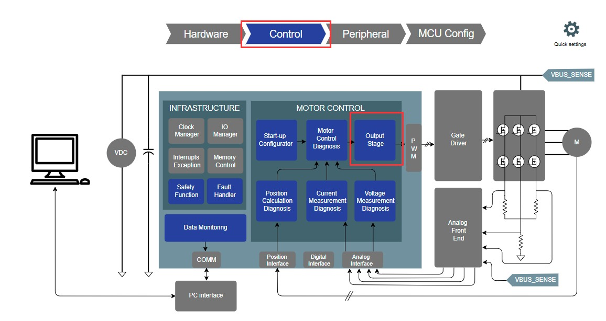
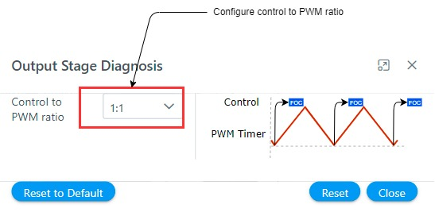

# Configure software modules
The **Harmony QSpin** provides end users to configure the motor control software modules as per their project requirements. 

## Output Stage and diagnosis
- Click on the "Output stage and diagnosis" block as shown below.
    

        
        <figcaption align= "center">Figure.6 - Output Stage and Diagnosis module </figcaption>
    

- Configure output stage parameters
    

        
        <figcaption align= "center">Figure.7 - Output Stage and Diagnosis module configuration </figcaption>
    
