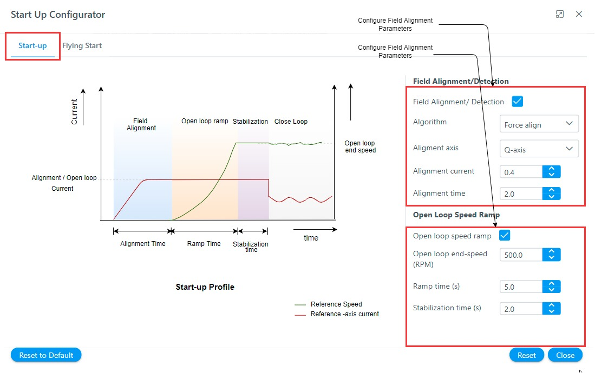

# Configure software modules
The **Harmony QSpin** provides end users to configure the motor control software modules as per their project requirements. 

## Start-up Configurator
The sensorless position estimation techniques based on back-EMF require a minimum value of back EMF to estimate the electrical position of the rotor. The open-loop start-up procedure drives the PMSM till its speed reaches the minimum value where the back EMF values are large enough to estimate the rotor position.
In the open-loop start-up procedure, the speed loop is de-activated.  The currents are controlled directly in the dq reference frame by using assumed rotor position angles for transformations. 
The complete start-up procedure can be divided into following phases:

- **Initial Field Alignment**. In this phase, the PMSM rotor is locked to a specified rotor position by keeping a fixed rotor position angle. The d-axis or q-axis current is gradually ramped to the a specified value to avoid any over-current issues. 

- **Open-loop Ramp**. In this phase, the rotor position is constantly incremented based on user-defined ramp time to achieve the minimum required speed for the BEMF observer. The minimum ramp time and speed depend on PMSM drive electrical and mechanical parameters. This stage is the most critical step. Any mistuning of reference speed and acceleration can lead to start-up failure.

- **Stabilization**. In this phase, the PMSM is allowed to rotate at a constant open-loop speed. This step ensures a smooth transition to close loop mode.

Figure 1 shows a complete start-up procedure for a sensorless PMSM motor drive:

  
  <figcaption align= "center">Figure.1 - Open-loop Start-up Procedure </figcaption>

In **Harmony Qspin** the start-up configurator can be configured in following simple steps:
- Click on the "Start-up Configurator" block as shown below.
    

        
        <figcaption align= "center">Figure.2 - Open loop start-up module </figcaption>
    

- Configure the open loop start
    

        
        <figcaption align= "center">Figure.2 - Open-loop Start-up Configuration </figcaption>
    

- Configure flying start
    

        
        <figcaption align= "center">Figure.3 - Flying Start Configuration </figcaption>
    
