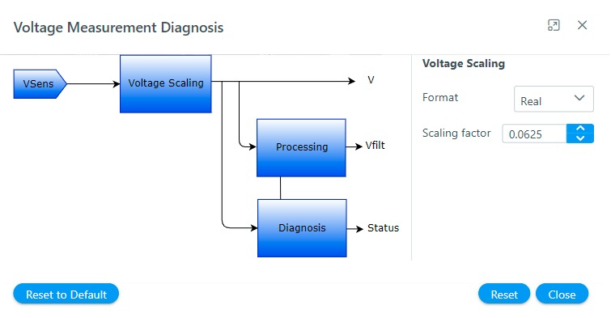

# Configure software modules
The **Harmony QSpin** provides end users to configure the motor control software modules as per their project requirements. 

## Voltage measurement and diagnosis
The **Voltage measurement and diagnosis** module is responsible for the implementation of motor voltage measurement technique required for the motor control application. 

In **Harmony Qspin** the **Voltage measurement and diagnosis** module can be configured in following simple steps:
- Click on the "Voltage measurement and diagnosis" block as shown below.
    

        
        <figcaption align= "center">Figure.10 - Voltage Measurement and Diagnosis module  </figcaption>
    

- Configure voltage measurement parameters
    

        
        <figcaption align= "center">Figure.11 - Voltage Measurement and Diagnosis module  configuration </figcaption>
    
