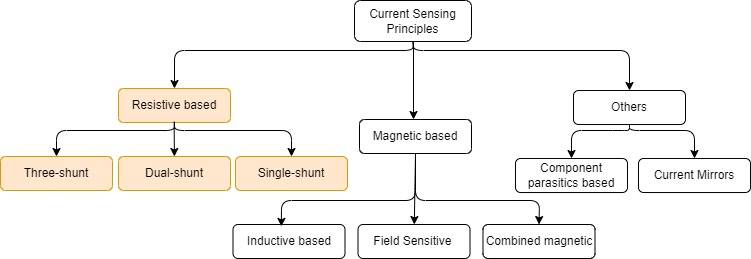
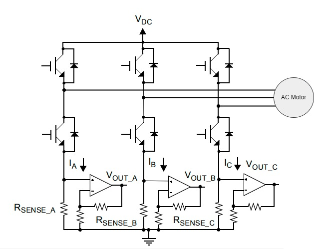
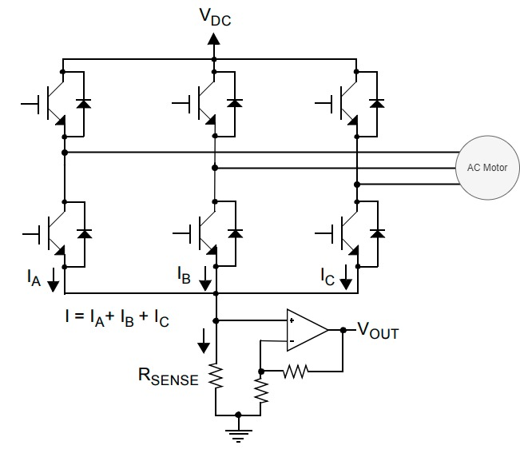

# Current Measurement
The phase current information is crucial to control the torque of the motor of an electric drive with Field Oriented Control. The following section describes different current measurement principles in an electric drive, and how it can be configured with Harmony Qspin.

## Current Measurement Principles:
Figure 1 shows different measurement principles used for phase current measurement in an electric drive.

  
  <figcaption align= "center">Figure.1 - Current Measurement Principles </figcaption>

Each of the above shown measurement principles has its own pros and cons. Discussion of all the measurement principles is beyond the scope on this section. Therefore, this document focuses on resistive based current measurement principles which are by far are the most sought after techniques.

## Resistive based
This technique places specially designed resistors usually referred as shunt resistors along the path of the current which has to be measured. The voltage drop across these shunt resistors is used to calculate the current values using Ohm's law as follows:

<!-- $
 i = \frac{V}{R}
$ --> 

The resistive based techniques cost-effective solution for most of the low and medium power electric drives. Its other advantages include high accuracy, high bandwidth, low temperature drift and unlike magnetic based sensors it does not have any remanence.  As with any other techniques resistive based techniques have their own drawbacks. By design, they do not provide any galvanic isolation, and incurs power losses while measurement. Refer [AN1332](https://ww1.microchip.com/downloads/en/AppNotes/01332B.pdf) for more details.

Based on where number shunts and their respective location for measuring current in an electric drive, the resistive based techniques can be classified into three categories:
1. Three shunt
2. Dual shunt
3. Single shunt 

### Three shunt
Figure 2 shows a three shunt phase current measurement technique.

  
  <figcaption align= "center">Figure.2 - Three shunt current measurement </figcaption>

This technique employs three shunt resistors along the three inverter legs. At each modulation cycle, when the low side FETs are switched on, the phase currents are measured.

The three shunt current measurement has some advantages. The three shunt technique generally selects the two samples for which the low side FET were switched on for a longer duration, and the third current is calculated from Kirchhoff's current law (KCL). Hence, a lower bandwidth amplifiers can be used to measure the voltages. Additionally, this makes over-modulation simpler.

### Dual shunt

Figure 3 shows a typical dual current measurement technique.

  
  <figcaption align= "center">Figure.3 - Dual shunt current measurement </figcaption>

This technique employs two shunt resistors along the three inverter legs. At each modulation cycle, when the low side FETs are switched on, the phase currents of the two respective legs are then measured. The third current is calculated from Kirchhoff's current law (KCL).

### Single shunt

Figure 4 shows a typical single current measurement technique.

  
  <figcaption align= "center">Figure.4 - Single shunt current measurement </figcaption>

This technique measures the DC link current and, with knowledge of the
switching states, reconstructs each of the three-phase currents. For more technical details refer [AN1299](https://ww1.microchip.com/downloads/en/Appnotes/01299A.pdf)

