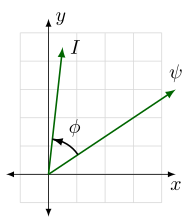

# Introduction
The Field Oriented Control (FOC) is the conventional control scheme for permanent-magnet synchronous motors. It generally results in smoother torque, slightly higher efficiency, and higher torque-speed curve, compared to six-step control, but requires a measurement or estimate of rotor position, and is more computationally intensive.

This section introduces the field oriented control.

## Torque Production in three-phase AC motor
A three-phase AC has a stationary part called the stator; a rotating part called the rotor. The stator consists of three-phase windings. When the stator is excited with a balanced three-phase voltage, it generates a rotating magnetic field. The rotor has generates its own magnetic field either using implanted magnets (in Permanent Magnet Synchronous Motors) or using electromagnets (Synchronous or Asynchronous AC motors). The rotor's magnetic field interacts with the stator's rotating magnetic field to produce the rotor torque. 

Electromagnetic torque <!-- $T_{em}$ -->  is proportional to the cross product of stator currents and rotor flux linkage. Here <!-- $\hat{z}$ -->  is a unit vector along the axis of rotation, <!-- $x$ -->  and <!-- $y$ -->  are components of a two-dimensional plane perpendicular to <!-- $\hat{z}$ --> , and the current vector is an equivalent vector sum of currents based on how the resulting fields are aligned with these <!-- $x$ -->  and <!-- $y$ -->  axes.
<!-- $
\begin{aligned}
T_{em} &= \tfrac{3}{2}N_{p}({\vec{{psi}}} \times \vec{I}) \\
       &= \tfrac{3}{2}N_{p}({\psi_{x}}{I_{y}} - {\psi_{y}}{I_{x}})\hat{z} \\
       &= \tfrac{3}{2}N_{p}{\psi}I{\sin{\phi}}
\end{aligned}
$ --> 

 

The angle <!-- $\phi$ -->  between flux linkage and current vectors, illustrated in Figure 1, plays an important role in determining electromagnetic torque. If the two vectors are aligned, this angle <!-- $\phi$ -->  is zero, and no torque is produced. Maximum torque occurs when the flux linkage and current vectors are perpendicular, and the term <!-- $\sin \phi$ --> .

    
    <figcaption align= "center"> Figure 1. Phasor diagram </figcaption>

Figure 1 Flux linkage vector, current vector, and the angle <!-- $\phi$ -->  between them, in an arbitrary <!-- $xy$ -->  coordinate frame.

It is important to note that these <!-- $x$ -->  and <!-- $y$ -->  axes are arbitrary — we can pick any unit basis vectors <!-- $\hat{x}$ -->  and <!-- $\hat{y}$ -->  that form a mutually perpendicular set with the axis of rotation <!-- $\hat{z}$ --> , such that their cross product <!-- $\hat{x} \times \hat{y} = \hat{z}$ --> .

There are two common choices for these basis vectors. One is the stationary frame, commonly aligned with one of the stator phases. Pictured on the left of Figure 2 is a three-phase stator with windings positioned 120° apart. This is equivalent — at least in terms of magnetic flux linkage — to a two-phase stator with orthogonal windings α and β, pictured on the right. For any combination of currents <!-- $I_A$ --> , <!-- $I_B$ --> , <!-- $I_C$ -->  in the three-phase stator winding, the same magnetic field seen by the rotor can be produced by an appropriate combination of currents <!-- $I_\alpha$ -->  and <!-- $I_\beta$ -->  through two “virtual” coils used to create the horizontal and vertical components of the stator field. The mathematical conversion of projecting three-phase quantities onto these virtual orthogonal coils is called the Clarke transform, after one of its originators, Edith Clarke. [2].

    
    <figcaption align= "center"> Figure 2. Current vector coils</figcaption>

Figure 2 Use of Clarke transform to convert between per-phase quantities and the <!-- $\alpha\beta$ -->  frame The angle reference is commonly aligned with the first motor phase and the <!-- $\alpha$ -->  winding. The rotor’s position is some electrical angle <!-- $\theta_r$ -->  relative to these angle references.

The Clarke transform is a linear transformation, shown in following equation, which can apply to any vector quantity <!-- $X$ --> , although typical examples are voltage <!-- $V$ --> , current <!-- $I$ --> , or flux linkage <!-- $\psi$ --> .

<!-- $
\begin{aligned}
X_{\alpha} &= \tfrac{2}{3}X_A - \tfrac{1}{3}X_B - \tfrac{1}{3}X_C \\
X_{\beta} &= \tfrac{1}{\sqrt{3}}X_B - \tfrac{1}{\sqrt{3}}X_C \\
\end{aligned}
$ --> 

We can substitute <!-- $(x,y) \Rightarrow (\alpha,\beta)$ -->  in above equation to get the following equation describing torque based on stationary-frame quantities:

<!-- $
T_{em} = \tfrac{3}{2}N_p \left(\psi_\alpha I_\beta - \psi_\beta I_\alpha\right)
$ --> 

In the stationary reference frame, the flux vector <!-- $\psi_{\alpha\beta}$ -->  and current vector <!-- $I_{\alpha\beta}$ -->  are not fixed, but rotate along with the rotor’s magnetic field.

The other common choice of basis vectors is the rotating reference frame, aligned with the electrical angle of excitation <!-- $\theta_e$ -->  as it increases with electrical frequency <!-- $\omega_e$ --> . This reference frame has components denoted dd (“direct”) and qq (“quadrature”). The transformation from <!-- ${\alpha\beta}$ -->  to <!-- $dq$ -->  axes is a rotation by an angle <!-- $-\theta_e$ --> . This is known as the Park transform, named for Robert Park, who developed it in the late 1920s, while working at General Electric to analyze the dynamics of synchronous motors. [1] [3] With permanent-magnet synchronous motors, this reference frame is known as the synchronous reference frame. Correct alignment for a PMSM occurs when the <!-- $d$ --> -axis is aligned with the rotor flux, and the electrical angle <!-- $\theta_e$ -->  is identical to the rotor’s electrical angle <!-- $\theta_e$ --> .

<!-- $
\begin{aligned}
X_{d} &= X_{\alpha}{\cos\theta_e} + X_{\beta}{\sin\theta_e} \\
X_{q} &= -X_{\alpha}{\sin\theta_e} + X_{\beta}{\cos\theta_e} 
\end{aligned}
$ --> 

We can substitute <!-- $(x,y) \Rightarrow (d,q)$ -->  in Equation 5.2 to obtain Equation 5.9, describing torque based on synchronous-frame quantities:

<!-- $
T_{em} = \tfrac{3}{2}N_p \left(\psi_d I_q - \psi_q I_d\right)
$ --> 

The advantage of using the synchronous frame is that for steady-state rotation, to produce constant electromagnetic torque <!-- $T_{em}$ --> , the flux linkage vector <!-- $\psi_{dq}$ -->  and the current vector <!-- $I_{dq}$ -->  are constants. This allows current controllers with an integrator term to operate with zero steady-state error. It also allows for independent torque and flux control.

It is worth noting that for different motor types, the angle of the reference frame <!-- $\theta_e$ -->  and the electrical angle of the rotor <!-- $\theta_r$ -->  may or may not be identical. For permanent-magnet synchronous motors, the reference frame should be aligned with the permanent magnet flux of the rotor, so that <!-- $\theta_e = \theta_r$ --> . For induction motors <!-- $\theta_e \ne \theta_r$ --> ; the electrical frequency <!-- $\omega_e = \omega_r + \omega_s$ -->  where <!-- $\omega_r$ -->  is the rotor speed expressed as an electrical frequency, and <!-- $\omega_s$ -->  is the slip frequency needed to produce rotor current.

## FOC block diagram
The general structure of an FOC controller is an inner vector current loop, and an outer velocity loop, as shown in Figure 3.

    
    <figcaption align= "center">Figure 3. FOC Block Diagram</figcaption>

The inner vector current loop has a current controller that operates in the synchronous <!-- $(dq)$ -->  frame. Park and Clarke transforms are used in the feedback path to convert measured phase currents to the synchronous frame as inputs to the current controller, and in the forward path to convert desired synchronous-frame voltages <!-- $V_{dq}$ -->  to realizable PWM duty cycles in a three-phase bridge.

In its linear range, there is nothing particularly special about the vector current loop, and it is often realized as two PI controllers, one for the d axis and the other for the q axis. Saturation and anti-windup should be designed carefully, keeping in mind the overall vector controller, rather than as two independent axis controllers.

The following steps summarize the basic sensorless FOC operation:

- **Measure the current flowing in the motor**. There are several ways to measure the three-phase currents flowing in the motor. Some popular options include measurement using hall-effect or transformer-based magnetic sensors or using strategically placed one, two or three shunt resistors.

- **Estimate the rotor flux angle**. The rotor flux angle can be estimated by either back EMF-based algorithms or by high-frequency pulse injection.

- **Transform the measured current to <!-- ${\alpha\beta}$ -->  reference frame**. The measured phase currents of the motor are transformed to two orthogonal components in <!-- ${\alpha\beta}$ -->  reference frame by Clarke Transformation.

- **Transform the <!-- ${\alpha\beta}$ -->  current to <!-- $dq$ -->  current**. The <!-- ${\alpha\beta}$ -->  are transformed to two orthogonal components in <!-- $dq$ -->  reference frame using the estimated rotor flux angle by Park Transformation. 

- **Compare the measured <!-- $dq$ -->  current with the desired current and generate an error signal**. The desired <!-- $q$ --> -axis reference current for controlling the torque, and desired <!-- $d$ --> -axis current for controlling the flux are compared with their corresponding measured quantities to generate respective error signals.

- **Calculate control voltage from the error signal**. The error signals are used to calculate correction voltage. Conventionally a closed-loop feedback mechanism using a PI regulator is used for the task. 

- **Apply control voltage to motor terminals**. The correction voltage in <!-- $dq$ -->  reference frame is transformed back to voltages in <!-- $abc$ -->  reference frame. These voltages are applied to the motor terminals by some power switching techniques. Conventionally in MCU-based systems, PWM modulation techniques like Space Vector modulation are used for the task.

## References
Some of the material in this section was adapted from the section “FOC in Fifteen Minutes” from the 2016 MASTERS presentation How to Succeed in Motor Control.

1. 	R. H. Park, “Two-reaction theory of synchronous machines generalized method of analysis-part I,”, Transactions of the American Institute of Electrical Engineers, vol. 48, no. 3, pp. 716-727, July 1929.

2. 	W. C. Duesterhoeft, M. W. Schulz and E. Clarke, “Determination of Instantaneous Currents and Voltages by Means of Alpha, Beta, and Zero Components,”, Transactions of the American Institute of Electrical Engineers, vol. 70, no. 2, pp. 1248-1255, July 1951.

3. 	C. J. O’Rourke, M. M. Qasim, M. R. Overlin and J. L. Kirtley, “A Geometric Interpretation of Reference Frames and Transformations: dq0, Clarke, and Park,”, IEEE Transactions on Energy Conversion, vol. 34, no. 4, pp. 2070-2083, Dec. 2019. Also available via MIT Open Access.

4.	D. Busse, J. Erdman, R. J. Kerkman, D. Schlegel and G. Skibinski, “Bearing currents and their relationship to PWM drives,”, IEEE Transactions on Power Electronics, vol. 12, no. 2, pp. 243-252, March 1997.

5. 	Annette von Jouanne and Haoran Zhang, “Bearing Currents: A Major Source of Mechanical Failure for Motors in Adjustable Speed Drive Applications”, Turning Point (US Department of Energy), p. 3, Sep 1998.
6. 	IEC 60034-8 Rotating electrical machines, Part 8: Terminal markings and direction of rotation
7. 	For copper temperature coefficient, see the two sources below. The figure 0.00393/°C is bandied about quite a lot, but this was decided by convention in 1913, based on data available at the time. (See [8], page 4.) The 1979 article by Matula [9] identifies and re-publishes numerous datasets for copper resistivity measurements and proposes an interpolated table of Recommended Values for the Electrical Resistivity of Copper (see table 2) vs. temperature.

8.	“Copper Wire Tables”, National Bureau of Standards Handbook 100, February 1966.

9. 	“Electrical resistivity of copper, gold, palladium, and silver”, R. A. Matula, Journal of Physical and Chemical Reference Data, vol. 8, no. 4, pp. 1147-1298, Oct 1979.