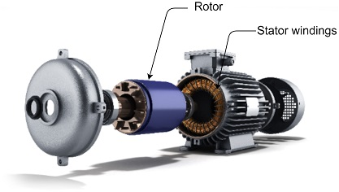
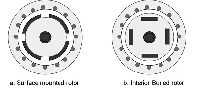

# Permanent Magnet Synchronous Motor 
The Permanent Magnet Synchronous Motor (PMSM) is the most preferred choice for motor control applications. Due to their permanent magnet rotor, they also have higher torque with smaller frame size and no rotor current, all of which are advantages over AC Induction Motors (AICMs). With their high power-to-size ratio, PMSMs can help make the design smaller without the loss of torque. These strengths enable the usage of PMSM in a broad range of variable frequency drives (VFDs) applications.

## Construction
Permanent Magnet Synchronous Motor (PMSM) is an AC synchronous motor driven by a three-phase controlled AC supply. 
Figure 1 shows a split view of a typical PMSM.

  
  <figcaption align= "center">Figure.1 - Split view of PMSM Motor </figcaption>

The PMSM has a stationary part called the stator; a rotating part called the rotor. The stator consists of three-phase windings. When the stator is excited with a balanced three-phase voltage, it generates a rotating magnetic field. The rotor has implanted permanent magnets on its core and generates the rotor's magnetic field. The rotor's magnetic field interacts with the stator's rotating magnetic field to produce the rotor torque. PMSMs are broadly classified into the following two categories depending upon the rotor construction: 
- Surface-mounted ( SPMSM )
- Interior-buried ( IPMSM )

The SPMSM has the permanent magnets fixed on the surface of the rotor leading to a symmetrical air-gap reluctance path between the rotor and the stator core. The IPMSM has the permanent magnets inserted inside the rotor core leading to a non-symmetrical air-gap reluctance path between the rotor and the stator core. 

Figure 2 shows the transversal-sectional view of surface-mounted and interior buried PMSM rotor configurations.

  
  <figcaption align= "center">Figure.2 - Rotor transversal section </figcaption>

## Mathematical Model 
The effective mathematical model of PMSM is critical for controller and observer design for PMSM based variable frequency drives. Even though PMSMs are inherently non-linear systems, they can be modeled as a simple linear time-invariant dynamical system for controller and observer design in most drive applications. The following section briefly introduces a simple linear dynamical model of the PMSM in the stationary and rotational reference frame

### Stationary Reference Frame Model 

The following equation represents the stationary model of PMSM:

<!-- $
  \vec{u}_{alpha}{\beta} = R_{s}{\vec{i}_{alpha}{\beta}} + {\frac{d}{dt}}{\bf{{L}}_{alpha}{\beta}}{\vec{i}_{alpha}{\beta}} + \vec{e}_{alpha}{\beta}
$ --> 

where <!-- $\vec{u}_{alpha}{\beta} = \begin{bmatrix}u_{alpha} & u_{\beta}\end{bmatrix}^T$ -->  is the stator voltage in stationary reference frame; <!-- $\vec{i}_{alpha}{\beta} = \begin{bmatrix}i_{alpha} & i_{\beta}\end{bmatrix}^T$ -->  is the stator current in stationary reference frame; <!-- $\vec{e}_{alpha}{\beta} = \begin{bmatrix}e_{alpha} & e_{\beta}\end{bmatrix}^T$ -->  is the stator back EMF in stationary reference frame; <!-- $R_{s}$ -->   is the stator per phase resistance.

<!-- $
\bf{{L}}_{\alpha}{\beta} = 
\begin{bmatrix}
\frac{L_{d} + L_{q}}{2} + \frac{L_{d} - L_{q}}{2}\cos(\theta_{e})& \frac{L_{d} - L_{q}}{2}\sin(\theta_{e})\\[0.6em]
\frac{L_{d} - L_{q}}{2}\sin(\theta_{e}) & \frac{L_{d} + L_{q}}{2} + \frac{L_{d} - L_{q}}{2}\cos(\theta_{e})
\end{bmatrix}
$ --> 

    

<!-- $L_{d}$ -->  is the inductance when the winding axis is aligned to rotor flux axis; <!-- $L_{q}$ -->  is the inductance when the winding axis orthogonal to rotor flux axis; and <!-- $\theta_{e}$ -->  is the electrical rotor angle.

<!-- $
{\vec{e}_{\alpha}{\beta}} = 
\omega_{e}\lambda_{m}
\begin{bmatrix}
-\sin(2\theta_{e})\\[0.6em]
 \cos(2\theta_{e})
\end{bmatrix}
$ --> 

<!-- $\lambda_{m}$ -->  is the permanent magnet flux linkage; and <!-- $\omega_e$ -->    is the electrical speed of the motor.

### Rotational Reference Frame Model 
The rotational reference frame model of the PMSM is derived by linear transformation of the PMSM stationary frame to a rotating reference frame (Park's Transformation). The transformation essentially converts all sinusoidally varying components to DC components, thereby making control and analysis using classical control very simple. The step wise process of transformation is beyond the scope of this application note. Hence, the final result of the transformation is only shown. 

Equation 2.4 shows the rotational reference frame model of PMSM. 
<!-- $
  \vec{u}_{dq} = R_{s}{\vec{i}_{dq}} + {\frac{d}{dt}}{\bf{{L}}_{dq}}{\vec{i}_{dq}} + \omega_{e}\bf{J}{\bf{{L}}_{dq}} + \omega_{e}\begin{bmatrix} 0 \\[0.6em] \lambda_{m} \end{bmatrix}
$ --> 

where <!-- $\vec{u}_{dq} = \begin{bmatrix}u_{d} & u_{q}\end{bmatrix}^T$ -->   is the stator phase voltage in rotating reference frame; <!-- $\vec{i}_{dq} = \begin{bmatrix}i_{d} & i_{q}\end{bmatrix}^T$ -->  is the stator phase current vector in rotating reference frame; <!-- $R_{s}$ -->   is the stator resistance; <!-- $\omega_e$ -->  is the electrical speed of the motor; <!-- $\lambda_m$ -->  is the permanent magnet flux linkage; <!-- $\bf{J} = \begin{bmatrix} 0 & -1\\[0.6em] 1 & 0 \end{bmatrix} $ -->  is the rotational matrix. 

<!-- $
\bf{L_{dq}} = \begin{bmatrix} L_{d} & 0\\[0.6em] 0 & L_{q} \end{bmatrix}
$ --> 

    

<!-- $L_d$ -->  is the inductance when the winding axis is aligned to rotor flux axis; and  <!-- $L_q$ -->  is the inductance when the winding axis orthogonal to rotor flux axis.