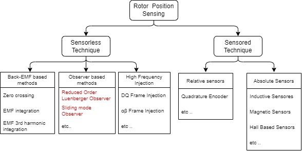

# Rotor Position Sensing 
The rotor position information is crucial to control the torque of the motor of an electric drive with Field Oriented Control. The following section describes different rotor position measurement technique in an electric drive, and how it can be configured with Harmony QSpin.

## Rotor Position Sensing Technique 
Rotor position measurement technique can be broadly classified into sensored techniques and sensorless techniques. The sensored techniques uses actual physical sensors to determine the rotor position, whereas sensorless techniques uses estimators or state observers with phase currents and voltages as inputs to determine the rotor angle.

Figure 1 shows different measurement rotor position sensing technique used in  electric drives.

  
  <figcaption align= "center">Figure.1 - Rotor Position Sensing Techniques </figcaption>

In this article, we will focus on the few of the popular rotor position measurement techniques, and how to configure them with **Harmony Qspin**.

### Quadrature Encoder 
Quadrature encoders, also known as incremental encoders or optical encoders, detect position and speed of rotating motion systems. 

A typical quadrature encoder includes a slotted wheel attached to the shaft of the motor and an emitter/detector module that senses the slots in the wheel. Typically, three output channels, Phase A (QEAx), Phase B (QEBx) and Index (INDXx), provide information on the movement of the motor shaft, including distance and direction. The Phase A and Phase B channels have a unique relationship. If Phase A leads Phase B, the direction of the motor is deemed positive, or forward. If Phase A lags Phase B, the direction of the motor is deemed negative or reverse. The Index pulse occurs once per mechanical revolution and is used as a reference to indicate an absolute position. For a relative timing diagram of these three signals, refer to Figure 1.

The quadrature signals produced by the encoder can have four unique states (01, 00, 10 and 11) that reflect the relationship between QEAx and QEBx. Figure 1 shows these states for one count cycle. The order of the states reverses when the direction of travel changes. The quadrature decoder increments or decrements the 16-bit Up/Down Counter (POSxCNT) for each change of state. The counter increments when QEAx leads QEBx and decrements when QEBx leads QEAx.

For more details refer <a href="https://ww1.microchip.com/downloads/en/Appnotes/Sensored-Encoder-Based)-Field-Oriented-Control-of-Three-Phase-%20Permanent-%20Magnet-%20Synchronous-DS00002757A.pdf">AN2757</a>

  
  <figcaption align= "center">Figure.1 - Quadrature Encoder </figcaption>

### Back EMF with PLL 
The Back EMF with PLL is a technique where the BEMF is used to estimate speed and position. It is based on the principle that when the stator and rotor magnetic fluxes are orthogonal to each other, the BEMF across the d-axis is '0'. The PLL is used to drive d-axis BEMF to zero, thereby estimating the rotor position and speed.

For more details refer [AN2520](https://ww1.microchip.com/downloads/en/Appnotes/Sensorless-FOC-For-PMSM-using-PLL-Estimator-FW-AN-DS00002520C.pdf) 
### Reduced Order Luenberger Observer 
The Reduced Order Luenberger Observer (ROLO) belongs to a class of linear observers used to estimate the internal state of an observable system based on the measured input and output. The ROLO is used to estimate the back EMFs of the PMSM. The BEMF vector position is found with an arctan() operation from the BEMF components, which is then used to estimate the rotor position angle. For more details refer [AN2590](https://ww1.microchip.com/downloads/en/AppNotes/00002590B.pdf) 

### Sliding Mode Observer 
The Sliding Mode Observers (SMO) belongs to a class of non-linear observers used to estimate the internal state of an observable system based on the measured input and output. The SMO is used to estimate the back EMFs of the PMSM. The BEMF vector position is found with an arctan() operation from the BEMF components, which is then used to estimate the rotor position angle. For more details refer [AN4398](https://ww1.microchip.com/downloads/en/AppNotes/00002590B.pdf) 

